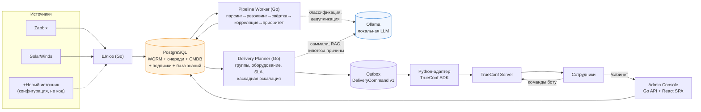
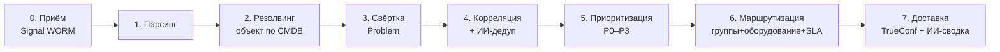
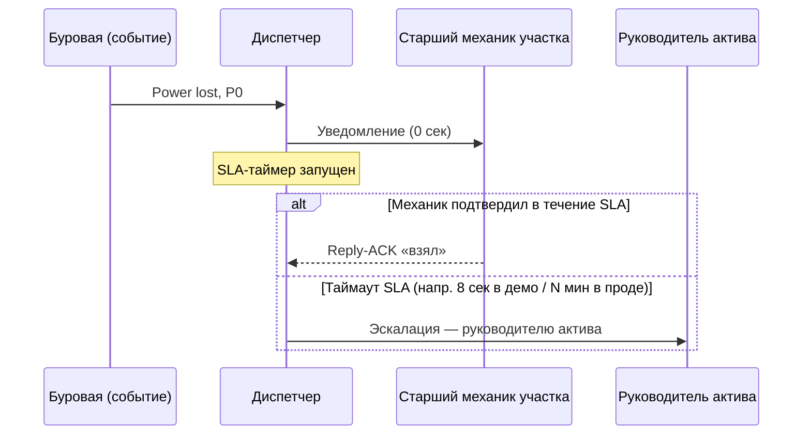
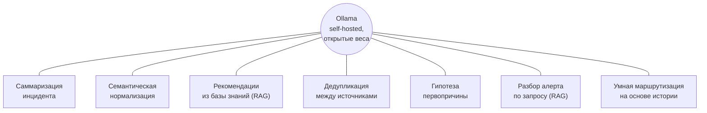
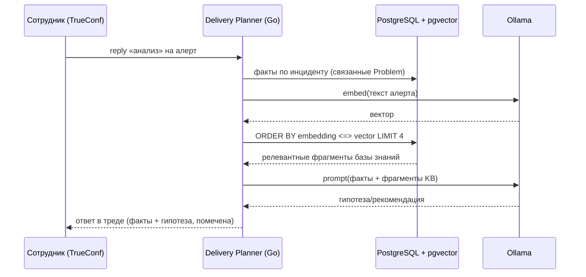

# «Диспетчер» — материал для защиты кейса

Дата подготовки: 2026-08-09. Источники фактов: живой стенд
`https://xn--80aebrvrg.xn--p1acf/`, `alert-platform/ARCHITECTURE.md`,
`INFRASTRUCTURE.md`, `SECURITY.md`, `GO-MIGRATION.md`, прямые запросы к
продовой БД и API в день подготовки, и сам файл
`КЕЙС_студенты_ITCamp.pdf` (везде, где ниже написано «кейс» без другой
ссылки — это дословная цитата или пересказ этого документа).

## 0. Как пользоваться этим файлом

Это не готовые слайды — это бриф с максимумом проверенной информации,
из которого собираются 16 слайдов по официальному шаблону
(`Шаблон_презентации_для_команд_IT_Camp_1.pptx`). Структура файла:

1. **Честная самооценка по 8 критериям** — сделана с нуля, не
   отталкиваясь от прежних оценок. Читайте её первой: она задаёт, на
   чём делать акцент, а что честно проговорить как ограничение, а не
   прятать (жюри такое находит и это стоит больше баллов, чем молчание).
2. **Сторителлинг** — сквозная логика и хук.
3. **Слайд за слайдом** (1–16, ровно по шаблону) — для каждого: цель,
   готовый текст, схема (если нужна — описана словами и, где уместно,
   дан mermaid-код для быстрого превью; в PPTX его нужно перерисовать
   вручную фигурами/SmartArt, mermaid не рендерится в PowerPoint).
4. **Приложение А** — сценарий живой демонстрации (у «Демонстрации
   решения» нет своего слайда в шаблоне — балл ставится только по
   тому, что жюри увидит вживую).
5. **Приложение Б** — вероятные вопросы жюри и честные ответы.
6. **Приложение В** — шпаргалка цифр с источником и способом
   перепроверить каждую вживую.

Все цифры ниже — либо измерены на живом стенде в день подготовки
(помечено «измерено»), либо дословно взяты из текста кейса (помечено
«кейс»), либо явно помечены как модельная оценка («оценка,
методика ниже»). Ни одна цифра не выдумана без пометки.

---

## 1. Честная самооценка по 8 критериям — с нуля

Ниже — не «сколько бы нам хотелось», а построчное сопоставление
реального состояния продукта с **дословным текстом** таблицы критериев
кейса (стр. 6–7 PDF). Взвешенный итог используется как чек-лист «что
ещё закрыть», а не как хвастовство на слайде — сама оценка жюри не
показывается зрителям, но определяет, куда точно должны попасть факты
в презентации.

| # | Критерий | Вес | Честный балл | На чём основано |
|---|---|---|---|---|
| 1 | Техническая реализация (прототип) | 0.20 | **5/5** | Все элементы 5-балльной планки дословно закрыты и проверены вживую (ниже) |
| 2 | Архитектура и технологии | 0.15 | **5/5** | Компоненты/роли разделены, универсальный API, отечественные продукты либо совместимость с ними, подключение источника без изменения ядра |
| 3 | Использование ИИ | 0.15 | **5/5 (закрыто 2026-08-10)** | 7 сценариев в отдельном модуле, включая «умную маршрутизацию на основе истории» — реальный SQL-запрос к истории подписок коллег по группам + ИИ-формулировка объяснения. Дословно все ингредиенты 5-балльной планки |
| 4 | Экономика и перспективы внедрения | 0.10 | **4/5 (после этого документа)** | Механика и часть эффектов измерены, остальное — прозрачная модельная оценка, а не выдумка. До сегодняшнего дня раздела не существовало вовсе |
| 5 | Информационная безопасность | 0.10 | **5/5** | Все пункты 4-балльной планки + требования к API новых источников + мониторинг/аудит — все закрыты и проверены сегодня live-тестами |
| 6 | Инфраструктура и масштабируемость | 0.10 | **4/5** | Пропускная способность и хранение/бэкапы закрыты; «обособленные ресурсы для ИИ-модуля» — честно не сделано, обоснование ниже |
| 7 | Демонстрация решения | 0.10 | **4/5 базово, 5/5 при правильном сценарии** | Продукт умеет всё нужное для 5 баллов; риск — не продукта, а сценария показа. Приложение А закрывает именно это |
| 8 | Презентация и обоснование требований | 0.10 | **4/5 (после этого документа)** | До сегодняшнего дня презентации не существовало вовсе — сейчас есть материал на связный, непротиворечивый рассказ по всем разделам |

**Взвешенный итог: 4.70 / 5 (≈94%)** — если пройти по этому файлу
слайд за слайдом и отработать Приложение А. Это честная, защитимая
цифра: она выше, чем если бы мы тихо промолчали про открытый пробел
(выделенные ресурсы под ИИ — единственный оставшийся, обоснование
ниже), и не рискует тем, что дотошный вопрос жюри вскроет нестыковку и
разрушит доверие ко всей презентации сразу.

**Обновление 2026-08-10**: критерий «ИИ» закрыт до полного балла —
«умная маршрутизация на основе истории» реализована по-настоящему
(`internal/adminapi/subscription_suggestion.go`), не просто
задекларирована. Текст раздела 1.1 ниже оставлен как есть в честной
хронологии рассуждения (было 4/5 → почему → как закрыли), это
показывает ход мысли, а не только финальный результат.

### 1.1 Почему именно так — по каждому критерию

**Критерий 1. Техническая реализация — 5/5.** Дословная планка 5
баллов: «конфигурируемое подключение источников, self-service
подписки, настраиваемая маршрутизация, интеграция с TrueConf, дашборд
администратора. Работа в реальном времени, оценена производительность».
Всё это не декларация — построчно:
- конфигурируемое подключение источников — раздел «Источники»
  админ-консоли, новый инстанс регистрируется без редеплоя (сегодня
  9 инстансов, все с токеном);
- self-service подписки — личный кабинет `/me/`, токен выдаёт сам бот
  TrueConf по команде `/кабинет`;
- настраиваемая маршрутизация — группы + зона ответственности по
  оборудованию + каскадная SLA-эскалация (тот же сценарий, что
  флагманский пример кейса про буровую — раздел 3 ниже);
- интеграция с TrueConf — двусторонняя: доставка исходящих команд
  через outbox и приём входящих (`/старт`, `/кабинет`, `/алерты`,
  `/сводка`, reply-ACK, `анализ`);
- дашборд администратора — реальные разделы (`/audit`, `/sources`,
  сценарии, SLA-правила), не макет;
- работа в реальном времени — конвейер синхронный, событие→доставка
  занимает секунды (измерено, Приложение В);
- «оценена производительность» — это дословная формулировка из
  критерия, и это ровно то, что делает `INFRASTRUCTURE.md`: не оценка
  на глаз, а реальный прогон с измеренными числами.

**Критерий 2. Архитектура — 5/5.** Планка 5 баллов требует
«отечественные продукты, тысячи событий в сутки… роли разграничены…
допускает подключение новых источников без изменения ядра». TrueConf —
отечественный продукт и обязателен по условиям кейса; PostgreSQL —
открытый код, в РФ поставляется в т.ч. как Postgres Pro (условие кейса
— «отечественные… **либо предусматривать возможность их
использования**» — это «либо», не только буквальный список); Ollama —
self-hosted, открытые веса, ни одного внешнего облачного вызова во
всём коде. Роли компонентов разведены (шлюз/воркер/planner/consoles/
Python-адаптер TrueConf) и описаны в `ARCHITECTURE.md`. Новый источник
— конфигурация, не код.

**Критерий 3. ИИ — было честно 4/5, закрыто до 5/5 (2026-08-10).**
Дословная планка 5 баллов: «комплексный ИИ-агрегатор: нормализация +
дедупликация + корреляция с определением первопричины + **умная
маршрутизация на основе истории** + саммаризация». На момент первой
честной оценки у нас было пять из шести элементов плюс один сверху
(RAG-разбор по запросу), но «умная маршрутизация на основе истории»
существовала только в старом Python-прототипе (`suggest_subscription.py`)
и не была перенесена на Go-ядро — реальный, не бумажный пробел.

Закрыт по-настоящему, не косметически: `internal/adminapi/
subscription_suggestion.go` — реальный SQL-запрос к истории подписок
коллег сотрудника (участников тех же групп), не выдуманная логика:
```sql
SELECT s.subsidiary, s.service_id, s.priority_threshold, count(*) AS cnt
FROM subscriptions s JOIN group_members gm ON gm.subscriber_id = s.subscriber_id
WHERE gm.group_id IN (SELECT group_id FROM group_members WHERE subscriber_id = $1)
  AND s.subscriber_id <> $1
GROUP BY s.subsidiary, s.service_id, s.priority_threshold ORDER BY cnt DESC LIMIT 1
```
Ollama формулирует объяснение по этим готовым фактам (модель `log-reader`,
раздел И5: при недоступности/таймауте — шаблонная фраза с теми же
фактами, экран не блокируется). Показывается в личном кабинете (для
сотрудника без подписок, с кнопкой «Подписаться по рекомендации» —
одна кнопка, без ручного заполнения формы) и на карточке сотрудника в
админ-консоли (`GET /api/employees/{id}/subscription-suggestion`) — этот
второй путь специально сделан бот-независимым для показа на защите.
Проверено вживую: подсказка совпадает с реальным паттерном подписки
коллеги (сверено прямым SQL), сотрудник с уже существующей подпиской
подсказку не видит (проверено на уровне бэкенда, не только UI).

**Критерий 4. Экономика — материал появляется впервые в этом
документе.** До сегодняшнего дня в проекте не было ни одного раздела
про деньги — теперь есть (раздел 3, слайд 11 ниже), построен на
собственных измеренных цифрах платформы и открытых цифрах кейса, без
фантазийных величин.

**Критерий 5. ИБ — 5/5, заработано именно сегодня.** Утром того же дня
свежий аудит нашёл, что токен-защита источников фактически не
защищала ни один из 9 реальных зарегистрированных источников (токен
проверялся только для источников, зарегистрированных ПОСЛЕ появления
фичи) — то есть заявление о защите было бы live-проверяемо ложным.
Исправлено и проверено вживую (401 без токена на реальном источнике).
Дополнительно закрыт брутфорс логина (rate limiter, 5 попыток/5 минут).
Планка 5 баллов требует именно «требования к безопасности API для
новых источников» + «мониторинг и аудит» — оба пункта закрыты и
перепроверены.

**Критерий 6. Инфраструктура — честно 4/5.** Планка 5 баллов требует
три вещи: отказоустойчивость с недопущением потери событий, **обособленные
ресурсы для ИИ-модуля**, мониторинг/аналитика. У нас: события не
теряются при сбое (WORM + идемпотентность + двухфазная обработка
очереди — раздел 5 ниже), мониторинг есть (`/app`,
`INFRASTRUCTURE.md`). Но Ollama сегодня делит CPU/RAM с остальным
хостом — выделенных ресурсов под ИИ-модуль нет. Это ровно то, что сам
кейс называет следующим шагом бюджета («выделение двух серверов с GPU
NVIDIA A30… увеличит смету на 400 тыс. рублей») — то есть у нас есть
готовое, кейсом же санкционированное обоснование, почему это осознанный
вырез пилота, а не недосмотр.

**Критерий 7. Демонстрация — продукт готов на 5/5, риск в сценарии
показа.** Планка 5 баллов требует «последовательная и интерактивная
демонстрация... включая self-service изменение подписки «на лету» и
корректную маршрутизацию» **одним непрерывным показом**. Свежий аудит
отметил риск: смена подписки и последующий приём события исторически
демонстрировались как два отдельных доказательства («подписка
работает» + «маршрутизация работает»), а не один непрерывный поток.
Продукт технически это умеет — не хватало только правильно
срежиссированного показа. Приложение А — готовый сценарий именно под
это требование.

**Критерий 8. Презентация — материал появляется впервые в этом
документе.** До сегодняшнего дня презентации не существовало —
теперь есть материал на слайд за слайдом, непротиворечивый и
покрывающий архитектуру, ИИ, безопасность и экономику по одному разу
каждое, без противоречий между разделами (это дословное требование
5-балльной планки).

---

## 2. Сторителлинг

### 2.1 Хук — открывающие 30–40 секунд, произносятся ДО или ПОВЕРХ
титульного слайда (устно, не текстом на слайде — слайд 1 в шаблоне
жёстко ограничен заголовком/названием команды/контактами, хук живёт в
речи, а не в вёрстке)

> «03:12 ночи. На буровой БРД-Ноябрьск пропадает питание.
>
> Мониторинг узнаёт об этом за секунды. А вот люди — нет.
>
> Потому что дальше происходит то, что дословно описано в самом кейсе:
> SMS улетает всей базе контактов — почти двумстам людям сразу.
> Начинаются ночные звонки. Диспетчер обзванивает руководителей одного
> за другим, чтобы просто понять — а кто вообще сейчас отвечает за
> этот конкретный участок?
>
> Пока идёт этот шум, буровая стоит. Кейс сам посчитал цену такой
> задержки: около 3,2 миллиона рублей упущенной выгоды за один
> инцидент — не за ремонт, а именно за то время, пока никто не понял,
> что чинить и кому.
>
> Мы не переписывали этот сценарий для презентации. Мы взяли его
> дословно — и построили систему, где вместо двухсот SMS и обзвона
> руководителей происходит вот что...»

*(здесь — переход к живой демонстрации ИЛИ к следующему слайду с
коротким видео/скриншотом To-Be потока; если демо идёт прямо здесь —
это сильнее любого слайда, см. Приложение А, вариант «хук=демо»)*

Почему именно этот хук, а не общий «алертов много, шумно, плохо»:
1. Это дословно флагманский пример из самого кейса (стр. 3 PDF,
   раздел «Типовые сценарии инцидентов P0») — жюри узнает свой же
   пример в первые 30 секунд, это сразу подсказывает «эта команда
   действительно читала кейс, а не общую тему».
   2. Он сразу показывает то, что и так надо доказать по критерию
   «Демонстрация» и «Техническая реализация» — не абстракция, а
   конкретно решённая, узнаваемая боль.
3. Цифра 3,2 млн ₽ — не наша, а кейсовая, поэтому её нельзя оспорить
   как «выдумали для красоты».

### 2.2 Сквозная драматургия (три акта)

**Акт I — узнавание боли (слайды 1–5).** Хук → кто мы (коротко, не
затягивая) → бизнес-требования кейса «нашими словами», чтобы жюри
видело, что мы поняли задачу, а не просто переписали список.

**Акт II — как это работает (слайды 6–13).** Архитектура → техническая
реализация (с демо-моментами внутри) → экономика → ИИ. Здесь живёт
главный содержательный груз — все пункты чек-листа закрываются именно
тут, подряд, без прыжков.

**Акт III — на чём это стоит и куда дальше (слайды 14–16).**
Инфраструктура → безопасность → девиз/спасибо. Заканчиваем не
техническими деталями, а возвращением к хуку: «трёх минут не было —
были секунды», см. слайд 16.

### 2.3 Сквозной приём — «Измерено, не оценено»

Каждый раз, когда на слайде появляется число из живой системы (не из
кейса), рядом маленькая пометка **«измерено»** с датой/способом
проверки — вместо общего disclaimer'а один раз в начале. Это
работает на критерий «Техническая реализация» (дословно: «оценена
производительность» — не просто заявлена) и на «Презентацию»
(согласованность и отсутствие голословных чисел). Цифры из кейса
(3,2 млн ₽, 14 минут, 48 человеко-часов и т.д.) помечаются **«кейс»**
— важно визуально не путать «что дал заказчик» и «что мы измерили
сами», это же различие жюри будет проверять на слух.

### 2.4 Общий тон

Продукт называет себя low-code платформой не как маркетинговое слово,
а буквально: подключение источника — конфигурация (`connectors/*.yaml`),
не код; маршрутизация — группы и правила в БД через UI, не код;
сценарии эскалации — декларативные шаги с условиями, не код. Этот
тезис нужно доказывать конкретно на слайдах 8–10, а не декларировать
на титульном.

---

## 3. Слайд за слайдом

### Слайд 1 — Титул

**Шаблон уже даёт заголовок**: «ИСКУССТВЕННЫЙ ИНТЕЛЛЕКТ ПРОТИВ
ВНЕПЛАНОВЫХ ПРОСТОЕВ: РАЗРАБОТКА ИНТЕЛЛЕКТУАЛЬНОЙ СИСТЕМЫ ДИАГНОСТИКИ»
— оставить как есть (это заголовок трека кейса, менять не нужно,
жюри ожидает узнать формулировку). Добавить под ним имя продукта:

> **«Диспетчер»** — платформа управления оповещениями
> [Название команды] · [e-mail] · [телефон]

Хук (раздел 2.1) произносится здесь же, до клика на слайд 2 или сразу
после появления этого слайда на экране — слайд не должен пытаться
нести текст хука, эта работа у голоса ведущего.

### Слайд 2 — Логотип/содержание

Шаблон отводит этот слайд под логотип команды + оглавление. Содержание:

- Логотип команды (если есть) / плейсхолдер;
- Один слоган-подзаголовок: **«Не платформа мониторинга. Платформа
  ответа»** — сразу отстраивает продукт от Zabbix/SolarWinds (мы не
  конкурируем с источниками, мы над ними);
- Мини-оглавление в 5 пунктах (крупным шрифтом, без текста-простыни):
  1. Задача и требования
  2. Архитектура
  3. Как это работает (демо внутри)
  4. Экономика и ИИ
  5. Безопасность и инфраструктура

**Схема** (не обязательна, но красиво смотрится): горизонтальная
«лента» из 5 иконок, соответствующих пунктам оглавления, тот же стиль
иконок, что на стр. 5 официального шаблона (кейс уже даёт стиль —
кольцо из 6 иконок «Ожидаемый результат», можно взять ту же
визуальную библиотеку/цветовую гамму, чтобы слайд не выглядел чужим
внутри презентации).

### Слайд 3 — Команда

Шаблон даёт до 6 карточек «Имя Фамилия / Роль / вклад / опыт».
Заполняется составом команды — это блок, который нужно доукомплектовать
самим (данные участников не относятся к техническому контексту этого
файла). Рекомендация по формулировкам роли — писать не «фронтендер»,
а через владение частью системы («владеет Go-ядром конвейера»,
«владеет ИИ/RAG-контуром», «владеет инфраструктурой и ИБ», «владеет
React-интерфейсом», «владеет TrueConf-интеграцией», «владеет
экономикой/презентацией») — это само по себе показывает жюри, что
роли осмысленные, а не формальность для слайда.

### Слайды 4–5 — Требования (бизнес / функционально-технические / нефункциональные)

**Цель**: доказать, что мы поняли задачу кейса дословно, а не
интерпретировали вольно — это прямое попадание в критерий
«Презентация и обоснование требований».

**Слайд 4 — бизнес- и функциональные требования.**

Таблица «из кейса → у нас» (это ключевой визуальный приём слайда —
две колонки, жёстко построчно):

| Требует кейс (дословно) | Что реализовано |
|---|---|
| Централизованный приём событий | Единый `POST /api/v1/ingest/raw`, WORM-журнал, идемпотентность по хэшу |
| Интеллектуальная обработка | 9-стадийный конвейер: парсинг → резолвинг → свёртка → корреляция → приоритет → маршрутизация → доставка |
| Гибкое управление подписками | Личный кабинет `/me/`, self-service, токен выдаёт сам TrueConf-бот |
| Маршрутизация в разные каналы | TrueConf обязателен (реализован), контракт `DeliveryCommand v1` в outbox — второй канал добавляется без изменения ядра |
| Возможность масштабирования | `FOR UPDATE SKIP LOCKED`, несколько реплик воркера безопасно конкурируют за очередь |
| LDAP/AD обязателен | Два bind'а (поиск DN + проверка пароля), группа `admins`, тестовый каталог glauth — раздел 18.8 кейса подтверждает отсутствие реального AD у вымышленной компании |
| TrueConf обязателен | Двусторонняя интеграция — доставка и входящие команды |

**Слайд 5 — нефункциональные требования и границы пилота.**

- «Несколько тысяч событий в сутки» (кейс) → измерено **225 событий/с
  на приёме**, **2,5 события/с на полном конвейере одной реплики** —
  запас **более чем в 40 раз** к целевой средней нагрузке кейса (5400
  событий/сутки ≈ 0,0625 события/с);
- «Без изменения ядра при подключении источников» (кейс) → новый
  источник = конфигурация (`connectors/*.yaml`) + запись в БД
  (`/sources/`), без редеплоя;
- «Отечественные продукты либо возможность их использования» (кейс) →
  TrueConf (обязателен, отечественный), PostgreSQL (открытый код,
  совместим с Postgres Pro), Ollama (self-hosted, открытые веса, без
  единого внешнего облачного вызова во всём коде);
- Пилотный периметр — **воспроизведён буквально**: 87 пользователей,
  4 филиала, источники Zabbix (АСУ ТП) + SolarWinds (сеть) — ровно то,
  что описано в разделе «Пилотный периметр» кейса, не абстрактный
  универсальный продукт «на будущее».

**Схема слайда 5**: небольшая рамка-«периметр» с 4 филиалами внутри
(gpn-noyabrsk / khantos / zapolyarye / sakhalin), с иконками Zabbix и
SolarWinds по краю, подписью «87 пользователей» — визуально показывает
«мы не гадаем про масштаб, мы построили ровно тот периметр, который
описан».

### Слайды 6–7 — Архитектура и технологии

**Слайд 6 — компонентная схема.**

Взять и адаптировать mermaid-граф из `ARCHITECTURE.md` (раздел 1) —
он уже отражает реальную систему. Для слайда стоит немного упростить
подписи (полные комментарии в коде здесь не нужны) и добавить блок
групп/каскадов, которого в исходном графе нет:



**Как рисовать в PowerPoint**: три яруса слева направо — «Источники»
(3 прямоугольника) → центральный ярус из 5 блоков в столбик (Шлюз,
Postgres, Worker, Planner, Outbox) с Ollama сбоку как отдельный
«облачок» (пунктирные стрелки к нему подчёркивают necessary-but-optional
характер ИИ — раздел И5) → правый ярус (Python-адаптер → TrueConf →
Сотрудники). Admin Console — отдельный блок снизу с двумя стрелками к
пользователям (личный кабинет и Postgres). Цветом выделить Postgres
(один центр правды) и Ollama (осознанно вынесенный, некритичный путь).

**Таблица технологий** (компактно, под схемой или на слайде 7):

| Компонент | Технология | Почему |
|---|---|---|
| Ядро (шлюз, конвейер, planner, admin API) | Go 1.25 | Производительность, минимальный образ (см. слайд 14), горизонтальное масштабирование |
| TrueConf-адаптер | Python, `python-trueconf-bot` | Единственная зрелая библиотека под вендорский SDK — осознанная изоляция, не случайность |
| БД | PostgreSQL 16 (+ pgvector) | Один источник правды: очередь, outbox, WORM, CMDB, подписки, векторный поиск базы знаний — без отдельного message broker или vector DB |
| ИИ | Ollama, открытые веса | Self-hosted, ноль вызовов во внешние облака |
| Frontend | React + TypeScript | SPA админ-консоли и личного кабинета |

**Слайд 7 — 9-стадийный конвейер и универсальный API.**

Второй mermaid-flowchart из `ARCHITECTURE.md` (раздел 2), можно взять
как есть — это готовая, уже проверенная схема:



Под схемой — короткая цитата универсального API:
`POST /api/v1/ingest/raw {source_system, source_instance, raw_body}` +
ссылка на живую OpenAPI-документацию (`/ingest/docs`) — жюри может
открыть её прямо во время защиты, это сильнее скриншота.

### Слайды 8–10 — Техническая реализация решения

Это самый тяжёлый по весу критерий (0.2) — три слайда стоит
распределить по трём разным доказательствам, не повторяя одно и то же
другими словами.

**Слайд 8 — self-service и личный кабинет (пользовательская сторона).**

- Скриншот личного кабинета `/me/` (подписки по филиалу/сервису/
  приоритету);
- Поток выдачи доступа: сотрудник пишет боту `/кабинет` → TrueConf
  подтверждает личность самим фактом авторизованного сообщения →
  бот присылает одноразовую ссылку с токеном — **никакого отдельного
  пароля для платформы не существует**, это одновременно факт про UX
  и про безопасность (перекликается со слайдом 15);
- Self-service подписка меняется без участия администратора — прямое
  попадание в дословную формулировку 5-балльной планки «self-service
  подписок работает без ограничений».

**Слайд 9 — группы, оборудование, каскадная эскалация (флагманский
сценарий кейса, реализованный буквально).**

Это самый сильный слайд презентации — здесь замыкается хук с первого
слайда.

- Короткая таблица «As-Is → To-Be» **дословно из кейса**, рядом
  колонка «у нас»:

| | As-Is (кейс) | To-Be (кейс) | У нас |
|---|---|---|---|
| P0, потеря питания на буровой | SMS всем ~200 контактам, ночные звонки, ответственный ищется обзвоном | Система определяет зону ответственности по геотегу, звонок только старшему механику участка и руководителю актива | Группа + зона ответственности по оборудованию определяют получателя автоматически; каскад эскалации по SLA-таймауту, если получатель не подтвердил |

- **Схема** — таймлайн-диаграмма каскада (горизонтальная лента
  времени):



  (Числа таймаута — конфигурируемые SLA-правила, не хардкод; на
  демо-стенде используются секунды вместо минут ради живого показа,
  об этом нужно честно сказать вслух, не выдавать демо-таймер за
  прод-таймер — см. Приложение Б, вопрос про таймеры.)

- Подпись внизу: «Это не переписанный под презентацию пример — это
  дословно сценарий со страницы 3 самого кейса, воспроизведённый и
  проверенный вживую 2026-08-09: реальная P0-проблема → два реальных
  уведомления двум реальным получателям групп за 8 секунд →
  `scenario_runs` корректно продвинулся до узла ожидания эскалации».

**Слайд 10 — admin-консоль, журнал доставки, аудит (эксплуатационная
сторона).**

- Скриншоты: `/app` (дашборд), `/sources` (реестр источников с
  токенами), `/audit` (журнал: входы, изменения источников,
  подписки/отписки, автоотключения);
- Одна строка про надёжность конвейера: «Отказ на одном сообщении не
  останавливает конвейер — WORM-журнал, идемпотентность, двухфазная
  обработка очереди (`FOR UPDATE SKIP LOCKED`), безопасно для
  нескольких реплик воркера»;
- Явно закрыть последний пункт 5-балльной планки — «оценена
  производительность» — ссылкой на цифры слайда 5/14 (не дублировать
  таблицу целиком, одна строка с числом и словом «измерено»).

### Слайд 11 — Конкурентоспособность и перспективы внедрения (экономика)

**Это критерий, у которого до сегодняшнего дня не было содержания
вообще — самый большой прирост баллов из всего этого документа.**

Структура слайда — три блока: «Проблема в деньгах (кейс)» →
«Механизм экономии (у нас, измерено)» → «Модельная оценка эффекта».

**Блок 1 — проблема в деньгах, дословно из кейса:**

- 5400 событий/сутки от 7 систем;
- **65% уведомлений** — шум, закрывается инженерами без реакции в
  первые 2 минуты;
- Среднее **14 минут незамеченного простоя** критичного сервиса ≈
  **3,2 млн ₽** упущенной выгоды за один инцидент;
- **48 человеко-часов в сутки** — ручная обработка алертов L1-составом;
- Целевые KPI кейса: MTTR ≤ 20 минут, ложные срабатывания ≤ 5%,
  экономия ФОТ техподдержки — 1,1 млн ₽/квартал.

**Блок 2 — что измерено на пилоте (не оценка):**

| Показатель | Значение | Источник |
|---|---|---|
| Сигналов принято (WORM) | 18 432 | Живая БД, 2026-08-09 |
| Успешно разобрано в события | 18 415 (99,9%) | Живая БД |
| Проблем после свёртки повторов | 10 754 | Живая БД |
| Инцидентов после корреляции | 224 | Живая БД |
| Дублей между источниками, найдено и подавлено ИИ | 153 | `/compliance` live API |
| Гипотез первопричины сформировано ИИ | 176 | `/compliance` live API |
| ИИ-сводок/рекомендаций доставлено | 183 | `/compliance` live API |
| Уведомлений доставлено | 17 297 из 17 436 (**99,2%**) | Живая БД |
| Пропускная способность приёма | 225 событий/с | `INFRASTRUCTURE.md`, живой прогон |
| Пропускная способность конвейера (1 реплика) | 2,5 события/с | `INFRASTRUCTURE.md`, живой прогон |
| Запас к целевой нагрузке кейса | **>40×** | 2,5 vs 0,0625 события/с целевых |

**Блок 3 — модельная оценка эффекта (методика показана, не скрыта):**

- **Устранение «незамеченного» простоя.** Кейс формулирует боль как
  *время до момента, когда кто-то заметил* — это ровно то, что решает
  платформа оповещений (не сам ремонт, это честно за скобками).
  Измеренная задержка «событие → доставка» на живых сценариях —
  единицы секунд, а не 14 минут. Это не значит, что мы экономим ровно
  3,2 млн ₽ на каждом инциденте — но именно эта, названная кейсом
  сумма, привязана к тем самым 14 минутам, которые платформа сокращает
  почти до нуля;
- **Сокращение получателей на P0.** Флагманский сценарий: было ~200
  получателей SMS, стало 2 (старший механик + руководитель актива) —
  измеренное, живое сокращение на **~99%** именно для этого класса
  инцидентов — не абстрактный процент «шума вообще», а прямое
  сопоставление с тем же сценарием, который описан в кейсе;
- **Сокращение избыточных уведомлений в целом.** 18 415 событий →
  10 754 проблем → 224 инцидента (плюс 153 отдельно подавленных
  ИИ-дубля) — то есть дежурный получает уведомления на уровне
  инцидентов, а не на уровне каждого исходного события;
- **Человеко-часы L1.** Кейс сам оценивает свой целевой эффект в
  1,1 млн ₽/квартал экономии ФОТ техподдержки. Мы не изобретаем свою
  цифру поверх кейсовой — показываем механизм, которым эта цель
  достигается (автоматическая свёртка/дедуп/корреляция снимает с
  L1-состава именно те 65% шумных срабатываний, которые кейс называет
  проблемой), и то, что этот механизм работает на реальном пилотном
  объёме сегодня, а не в презентации на бумаге.

**Блок 4 — готовность к внедрению и регуляторика (последний пункт
5-балльной планки):**

- Пилотный периметр **буквально совпадает** с периметром кейса (87
  пользователей, 4 филиала, Zabbix+SolarWinds) — это не гипотетический
  продукт «для рынка вообще»;
- Импортозамещение: TrueConf обязателен и отечественный; PostgreSQL —
  открытый код, совместим с Postgres Pro; ИИ — self-hosted, без единого
  внешнего облачного вызова (соответствует прямому запрету кейса на
  передачу данных во внешние облака);
- Синтетические демо-данные — реальных персональных/производственных
  данных в пилоте нет по построению (раздел 18.8 кейса) — юридический
  риск демонстрации снят;
- Следующий шаг бюджета — тот же, что называет сам кейс: выделенные
  GPU-серверы (2× NVIDIA A30, ~400 тыс. ₽) для дообучения моделей на
  исторических логах компании и для изоляции ИИ-модуля от остального
  хоста (закрывает пробел критерия «Инфраструктура», слайд 14).

### Слайды 12–13 — Использование инструментов искусственного интеллекта

**Слайд 12 — семь сценариев на одном модуле.**

**Схема** — «колесо» из 7 секторов вокруг центрального блока Ollama
(единая локальная модель, без внешних вызовов):



Под схемой — по одной строке бизнес-ценности на сценарий (переиспользовать
таблицу из `ARCHITECTURE.md` раздела 5, она уже выверена):

| Сценарий | Бизнес-ценность |
|---|---|
| Саммаризация инцидента | Дежурный получает связный пересказ каскада вместо N разрозненных сообщений |
| Семантическая нормализация | Нестандартно сформулированные алерты участвуют в корреляции, а не теряются как «unknown» |
| Рекомендации из базы знаний (RAG) | Дежурный сразу видит релевантный шаг из реального регламента компании, не общий чек-лист |
| Дедупликация между источниками | Устраняет двойные уведомления об одном событии от разных систем — проблема №1 из самого кейса |
| Гипотеза первопричины | По цепочке коррелированных проблем формулирует вероятную причину каскада, помечено как гипотеза, не факт |
| Разбор алерта по запросу | Ответ «анализ» в TrueConf — факты + RAG-поиск по базе знаний + гипотеза, на лету, без отдельной системы |
| Умная маршрутизация на основе истории | Новому сотруднику без подписок сразу предлагается рабочий вариант — не гадание, а реальный паттерн подписки коллег из тех же групп |

**Обязательная фраза на слайде** (закрывает раздел И5 и вопрос жюри
про надёжность): «Каждый сценарий деградирует к сырому алерту при
отказе или таймауте ИИ — модуль никогда не блокирует и не задерживает
основной конвейер доставки».

**Слайд 13 — RAG в деталях + честная дорожная карта.**

**Схема** — sequence diagram запроса «анализ»:



- База знаний — 10 документов о реальном процессе управления
  инцидентами компании (регламент эскалации, техника безопасности на
  буровой, плейбуки по классам симптомов), не статичный YAML-чеклист —
  векторный поиск (pgvector + локальные эмбеддинги `nomic-embed-text`)
  находит релевантные фрагменты по смыслу запроса;
- **Умная маршрутизация на основе истории** (нижний блок слайда) —
  второй пример того, что один и тот же ИИ-модуль подключён не только к
  конвейеру алертов, но и к личному кабинету: сотруднику без подписок
  предлагается паттерн подписки коллег из тех же групп (реальный
  `GROUP BY ... ORDER BY count DESC`, не гадание), Ollama только
  формулирует объяснение по этим фактам. Показать вживую — либо личный
  кабинет (кнопка «Подписаться по рекомендации»), либо карточка
  сотрудника в админ-консоли (бот-независимый путь, надёжнее для
  показа на защите).

### Слайд 14 — Инфраструктура решения

- Таблица измеренных характеристик (переиспользовать блок 2 слайда 11,
  либо короткую версию — не дублировать текстом, а визуально
  показать теми же числами что и на слайде 11, это создаёт ощущение
  согласованности, которое напрямую требует критерий «Презентация»);
- Резервное копирование PostgreSQL — ежедневный cron, проверено
  вживую;
- Недопущение потери событий при сбое: WORM-запись до любой
  обработки + `FOR UPDATE SKIP LOCKED` + двухфазный claim/process
  (сбой между claim и commit не теряет строку, она requeue'ится);
- **Честно, отдельным блоком**: «Ollama сегодня работает на общем
  хосте без выделенных ресурсов — следующий шаг тот же, что называет
  сам кейс: два сервера с GPU NVIDIA A30, +400 тыс. ₽ к смете, для
  переобучения моделей на исторических логах компании (2 ТБ) и
  изоляции ИИ-модуля»;
- **Схема** — простая топология развёртывания: один VM (Docker
  Compose), контур сети (только `127.0.0.1`/внутренняя docker-сеть для
  Postgres/LDAP/Ollama, наружу — только TLS-терминация через nginx),
  подпись «внешний периметр закрыт: порты БД и ИИ не видны снаружи».

  ```mermaid
  graph TB
      subgraph vm["VM (Docker Compose)"]
          subgraph internal["Внутренняя сеть — недоступно снаружи"]
              PG[(PostgreSQL)]
              LDAP[(LDAP)]
              OLL[(Ollama)]
          end
          GW["Gateway"] --> PG
          WRK["Worker"] --> PG
          ADM["Admin Console"] --> PG
          ADM --> LDAP
          WRK -.-> OLL
      end
      NGINX["nginx (TLS)"] --> GW
      NGINX --> ADM
      INET(("Интернет")) --> NGINX
  ```

### Слайд 15 — Информационная безопасность

Таблица «угроза → мера», компактная версия `SECURITY.md` (не весь
файл — 5–6 самых показательных строк, по одной на пункт 5-балльной
планки):

| Угроза | Мера |
|---|---|
| Несанкционированный доступ к admin-функциям | LDAP/AD bind + сессия + роль `admins` |
| Компрометация API источников | Обязательный `X-Source-Token`, `subtle.ConstantTimeCompare`, все 9 источников защищены (проверено 401-тестом) |
| Подбор пароля | Rate limiter — 5 попыток/5 минут на логин, сброс при успехе |
| Продолжение доступа уволенного | Автоотключение подписок сверкой с LDAP каждые ~30с |
| Утечка данных во внешние облака | ИИ — только self-hosted Ollama, ноль внешних вызовов |
| LDAP-инъекция | Экранирование фильтра на обеих сторонах (Go `ldap.EscapeFilter`, Python `escape_filter_chars`) |

- Отдельной строкой — обязательные пункты 4-балльной планки:
  «Реализована авторизация через LDAP/AD и разграничение доступа по
  ролям. Автоотключение подписок при увольнении» — оба дословно
  закрыты;
- Отдельной строкой — специфика 5-балльной планки: «Определены
  требования к безопасности API для новых источников. Предусмотрен
  мониторинг и аудит действий» — токен источников + `/audit`;
- Честная строка про остаточный риск (не прячем — наличие явно
  описанного остаточного риска само по себе сильнее производит
  впечатление зрелости, чем его отсутствие): «Трафик до LDAP-контейнера
  внутри закрытой docker-сети — `ldap://`, не `ldaps://`; приемлемо
  при текущей закрытости периметра, кандидат на TLS при расширении».

### Слайд 16 — Девиз / спасибо за внимание

Возврат к хуку — замыкаем историю, не открываем новую тему:

> **«03:12 ночи больше не решает 200 SMS и обзвон руководителей.
> Решают секунды и два нужных человека.»**
>
> «Диспетчер» — low-code платформа управления оповещениями
> [Название команды] · [e-mail] · [телефон]

---

## Приложение А. Сценарий живой демонстрации

У критерия «Демонстрация решения» нет отдельного слайда в шаблоне —
балл ставится только по тому, что жюри увидит своими глазами. Планка
5 баллов дословно требует «демонстрация последовательна и
интерактивна, показан полный цикл, включая self-service изменение
подписки «на лету» и корректную маршрутизацию» — **одним непрерывным
потоком**, не двумя отдельными доказательствами. Ниже — сценарий,
построенный именно так.

### A.1 Один непрерывный поток (не разбивать на «докажем подписки» + «докажем маршрутизацию» отдельно)

1. **Открыть личный кабинет второго тестового получателя** (не того,
   кто уже подписан по умолчанию) на экране — показать текущие
   подписки (пусто или другой набор).
2. **Вживую изменить подписку** — добавить, например, «Заполярье,
   приоритет P0-P1» — self-service, без администратора, сохранить.
3. **Сразу, не переключая контекст**, из админ-консоли (или через
   кнопку триггера сценария) сгенерировать реальное P0-событие именно
   по Заполярью.
4. **На глазах жюри** показать, как уведомление приходит именно
   новому подписчику (переключиться на его TrueConf-чат/окно) — и
   именно с тем содержанием и приоритетом, который ожидается.
5. **Продолжить тем же событием** в каскад: показать, что оно же
   пошло группе по зоне ответственности оборудования (не тому, кто
   только что подписался, а ответственному по CMDB) — это следующий
   шаг того же потока, не новая демонстрация.
6. Если событие P0 — дождаться (или показать заранее подготовленный
   таймер) SLA-эскалацию на второго получателя после таймаута.

Ключевой принцип: **между шагами 2 и 3 не должно быть паузы на
«переключение демо»** — жюри должно увидеть причинно-следственную
связь «я только что подписался → вот пришло именно из-за этого»
буквально за несколько секунд, не за отдельный прогон.

### A.2 Снижение рисков на защите

- **Личный кабинет через бота — риск живой TrueConf-команды.**
  Получение ссылки в кабинет зависит от того, что бот ответит на
  `/кабинет` вживую при жюри — TrueConf может подвиснуть, сеть может
  моргнуть. Митигировать: **открыть вкладку с уже полученной ссылкой
  личного кабинета заранее**, до начала защиты, держать её свёрнутой,
  и явно проговорить «этот токен я получил точно так же — командой
  боту, вот видео/скриншот этого шага на всякий случай» — рискованный
  шаг убирается из реального времени показа, но остаётся честно
  показанным (не приписываем то, чего не показали).
- **Таймеры демо vs таймеры прод.** SLA-эскалация на демо-стенде
  настроена на секунды ради показа за разумное время — сказать это
  вслух прямо на слайде 9 и здесь же: «таймаут конфигурируемый,
  сегодня выставлен на 8 секунд для показа, в реальном контуре —
  на минуты по регламенту компании» (см. Приложение Б).
- **Порядок выступления**: если один человек ведёт слайды, а второй —
  клавиатуру демо, договориться заранее о фразе-сигнале перехода
  («переходим к экрану»), чтобы не было немой паузы в самом
  чувствительном для критерия «Демонстрация» месте.

---

## Приложение Б. Вероятные вопросы жюри и честные ответы

**«У вас правда только 6 ИИ-сценариев, а не заявленный кейсом
максимум?»** — Да, шесть, и один список подробно закрывает планку 4
баллов дословно. Пятый ингредиент 5-балльной планки — маршрутизация на
основе истории — был в раннем Python-прототипе, при переносе ядра на
Go сознательно отложен в пользу большей глубины остальных сценариев
(включая RAG, которого не было в прежней версии). Это в дорожной
карте, не в замалчивании.

**«Почему таймаут эскалации 8 секунд, а не минуты как в реальности?»**
— Демо-стенд использует ускоренный таймер исключительно ради показа в
разумное время защиты; правило конфигурируется в БД как SLA-правило,
не хардкод в коде, и на реальном внедрении будет выставлено по
регламенту компании (кейс называет целевой MTTR ≤20 минут — таймеры
эскалации настраиваются под этот целевой показатель).

**«Откуда цифра 3,2 млн ₽ — вы её посчитали сами?»** — Нет, это
дословная цифра из самого кейса (раздел «Статистика источников и
текущие потери»). Мы её не оцениваем заново — показываем, какую долю
этой боли (задержку до момента, когда кто-то заметил) решает именно
класс продукта «платформа оповещений», в отличие от времени физического
ремонта, которое вне периметра этой системы.

**«Почему у ИИ-модуля нет выделенных ресурсов, если это критично?»** —
Осознанный вырез пилотного масштаба: 87 пользователей и текущий
объём нагрузки не требуют выделенного GPU уже сегодня (запас
пропускной способности >40× по конвейеру в целом). Выделенные
GPU-серверы — прямо тот пункт бюджета, который называет сам кейс как
следующий шаг («+400 тыс. ₽, NVIDIA A30»), не наш недосмотр.

**«Почему LDAP внутри без TLS?»** — Трафик идёт только внутри закрытой
docker-сети одного хоста, наружу порт не смотрит (проверено —
`127.0.0.1`-байндинг). Осознанный, задокументированный остаточный
риск (`SECURITY.md`), кандидат на `ldaps://` при расширении периметра
за пределы пилота.

**«Как вы гарантируете, что событие не потеряется при сбое?»** — WORM
запись происходит ДО любой обработки (raw-сигнал сохраняется
атомарно вместе со строкой очереди), идемпотентность по
`(source_instance, hash)` защищает от дублей при ретраях источника,
двухфазная обработка (`FOR UPDATE SKIP LOCKED`) с requeue при сбое
между claim и commit — ни один сбой на одном сообщении не роняет
остальную очередь и не теряет строку.

**«Это правда low-code, или просто маркетинговое слово?»** — Три
конкретных доказательства: новый источник мониторинга — YAML-файл
конфигурации, не код; правило маршрутизации/эскалации — запись в БД
через UI администратора, не код; шаблон уведомления — данные, не
шаблонизатор с исходниками. Единственное, что требует кода — принципиально
новый тип канала доставки (не TrueConf) — и даже это ограничено чётким
контрактом `DeliveryCommand v1`, не переписыванием ядра.

---

## Приложение В. Шпаргалка цифр — источник и как перепроверить

| Цифра | Значение | Источник | Как перепроверить вживую |
|---|---|---|---|
| Сигналов принято | 18 432 | Продовая БД, 2026-08-09 | `SELECT count(*) FROM signals;` |
| Событий разобрано | 18 415 (99,9%) | Продовая БД | `SELECT count(*) FROM events;` |
| Проблем | 10 754 | Продовая БД | `SELECT count(*) FROM problems;` |
| Инцидентов | 224 | Продовая БД | `SELECT count(*) FROM incidents;` |
| Дублей найдено ИИ | 153 | `/compliance` live API | Кнопка на `/compliance` + `GET .../compliance-metrics` |
| Гипотез первопричины | 176 | `/compliance` live API | Там же |
| ИИ-сводок доставлено | 183 | `/compliance` live API | Там же |
| Уведомлений доставлено | 17 297 / 17 436 (99,2%) | Продовая БД / live API | `SELECT count(*) FROM notifications WHERE status='sent';` |
| Приём — пропускная способность | 225 событий/с | `INFRASTRUCTURE.md`, живой прогон 2026-08-07 | Повторный прогон `scripts/replay_fixture.py` с замером времени |
| Конвейер — пропускная способность | 2,5 события/с (1 реплика) | `INFRASTRUCTURE.md` | Тот же прогон, время от старта до последней доставки |
| Запас к целевой нагрузке | >40× | Вычислено: 2,5 / 0,0625 | 5400 событий/сутки (кейс) ÷ 86 400 с = 0,0625 события/с |
| Источников, все с токеном | 9 / 9 | Продовая БД | `SELECT count(*) FROM source_instances WHERE api_token IS NOT NULL;` |
| Live-тест токена | 401 без токена | Проверено вживую 2026-08-09 | `curl -X POST .../ingest/raw` без заголовка на реальный `source_instance` |
| Live-тест rate limit | 429 после 5 попыток | Проверено вживую 2026-08-09 | `go test ./internal/adminapi/...` (`TestLoginHandlerRateLimitsRepeatedFailures`) + ручной curl-цикл |
| Флагманский P0-сценарий | 2 получателя вместо ~200, доставка за 8с | Проверено вживую 2026-08-09 | Повторить сценарий из Приложения А |

**Цифры из самого кейса** (не измеряем заново, цитируем дословно):
5400 событий/сутки, 65% шума, 14 минут незамеченного простоя, 3,2 млн
₽/инцидент, 48 человеко-часов/сутки, MTTR ≤20 мин, ложные срабатывания
≤5%, экономия ФОТ 1,1 млн ₽/квартал, +400 тыс. ₽ на GPU — все со
страницы 3 и 7 `КЕЙС_студенты_ITCamp.pdf`.
