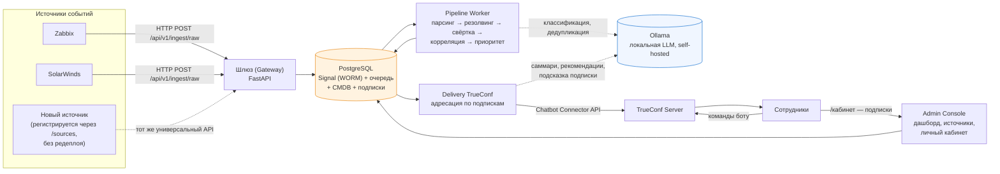
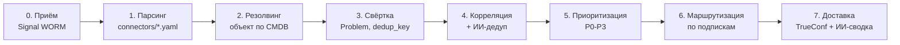

# Диспетчер — архитектура решения

Обязательный deliverable кейса («Ожидаемый результат», п.1): архитектурная
схема, взаимодействие сервисов, потоки данных, внешние интеграции. Это
техническое описание фактически реализованной и вживую проверенной
системы — не проектная гипотеза.

## 1. Компоненты и взаимодействие

**Роли компонентов:**

| Компонент | Технология | Роль |
|---|---|---|
| Шлюз (Gateway) | FastAPI | Приём сырых событий, запись в WORM, идемпотентность по хэшу |
| Pipeline Worker | Python, `FOR UPDATE SKIP LOCKED` | Парсинг → резолвинг → свёртка → корреляция → приоритет; горизонтально масштабируется (несколько реплик безопасно конкурируют за очередь) |
| PostgreSQL | PostgreSQL 16 | Очередь-как-БД, WORM-журнал сигналов, CMDB, подписки, история |
| Delivery TrueConf | Python, `python-trueconf-bot` | Адресация по подпискам, доставка NEW/CLOSURE/SUPPLEMENT/DUPLICATE_NOTE |
| Ollama | Открытые веса (self-hosted) | Пять ИИ-сценариев (раздел 4 ниже) — работает локально, без внешних API |
| Admin Console | FastAPI | Дашборд, регистрация источников, личный кабинет self-service |
| TrueConf Server | TrueConf | Обязательный корпоративный канал доставки (кейс, п.2 условий) |

## 2. Поток данных (9 стадий конвейера)

Каждая стадия — отдельный, независимо тестируемый модуль
(`services/pipeline/{parser,resolver,state_manager,correlator}`,
`packages/rules/priority.py`, `packages/common/routing.py`,
`services/delivery_trueconf/`). Отказ одной стадии на одном сообщении не
останавливает конвейер — раздел И5: событие остаётся в WORM, ошибка
видна в `SignalQueueEntry.error`, обработка остальных сообщений продолжается.

## 3. Технологический стек и импортозамещение

Кейс, п.3 условий: *«решение должно использовать отечественные программные
продукты либо предусматривать возможность их использования»*.

| Компонент | Выбор | Обоснование / импортозамещение |
|---|---|---|
| Канал доставки | **TrueConf** | Отечественный продукт, обязателен по условиям кейса |
| СУБД | **PostgreSQL** | Открытый исходный код, не привязан к одному вендору; в РФ поставляется в т.ч. как Postgres Pro — совместимая миграция при необходимости |
| ИИ-модуль | **Ollama + открытые веса** (модель `log-reader` на базе `qwen3-coder`) | Полностью self-hosted, без обращения к внешним облачным API — соответствует политике ИБ кейса («запрет передачи данных во внешние облака», раздел «Дополнительные вводные данные») |
| Backend | **Python (FastAPI, SQLAlchemy)** | Открытый исходный код, кросс-платформенный, не иностранный SaaS |
| Контейнеризация | **Docker Compose** | Инструмент сборки/запуска, не часть решаемой бизнес-задачи — при необходимости заменяется на Podman/аналог без изменения кода приложения |

Иностранных облачных сервисов (SaaS LLM, зарубежные мессенджеры, внешние
API мониторинга) в решении нет — все компоненты либо отечественные, либо
open-source и развёрнуты локально.

## 4. Универсальный API для подключения источников

`POST /api/v1/ingest/raw` (шлюз) — единая точка приёма для любого
источника: `{source_system, source_instance, raw_body}`. Формат `raw_body`
не типизирован жёстко — конкретный парсер описывается декларативно в
`connectors/*.yaml` (regex-селекторы полей, карта severity, правила
symptom_class), без изменения кода шлюза или воркера (кейс, п.2 условий:
*«подключение новых источников… без изменения ядра системы»*).

Живая OpenAPI-документация (Swagger UI, автогенерация FastAPI, не
статический макет):
- Шлюз: `https://xn--80aebrvrg.xn--p1acf/ingest/docs`
- Консоль/API подписок/дашборда: `https://xn--80aebrvrg.xn--p1acf/console/docs`

Подключение нового **инстанса** уже поддерживаемой системы (пятый филиал
Zabbix и т.п.) — через `/sources/` (раздел 5), без редеплоя. Подключение
принципиально новой системы мониторинга — новый `connectors/*.yaml`
(конфигурация, не код).

## 5. Пять ИИ-сценариев (`packages/ai/`)

Единый модуль, общий клиент Ollama (`packages/ai/client.py`), одинаковая
политика отказа везде — раздел И5: сбой/таймаут ИИ никогда не блокирует
конвейер, деградация до поведения без ИИ-компонента.

| Сценарий | Модуль | Бизнес-ценность |
|---|---|---|
| Саммаризация инцидента | `llm_summary` (delivery) | Дежурный получает связный пересказ каскада вместо N разрозненных сообщений |
| Семантическая нормализация | `classify.py` | Алерты с нестандартной формулировкой (не только точный regex) участвуют в корреляции, а не теряются как «unknown» |
| Рекомендации из базы знаний | `recommend.py` + `packages/rules/runbooks.yaml` | Дежурный сразу видит релевантный шаг диагностики, а не общий чек-лист |
| Дедупликация между источниками | `dedup.py` | Устраняет двойные уведомления об одном событии от разных систем мониторинга (кейс, проблема №1) |
| Подсказка подписки на основе истории | `suggest_subscription.py` | Новый подписчик сразу видит, на какой филиал исторически стоит подписаться первым — умная маршрутизация, а не ручной перебор |

## 6. Масштабируемость и подключение новых каналов

- **Источники**: конфигурация (`connectors/*.yaml`) + БД-реестр инстансов (`/sources/`) — без изменения ядра.
- **Каналы доставки**: TrueConf обязателен; `services/delivery_trueconf/` изолирован от остального конвейера через таблицу `Notification` — второй канал добавляется как параллельный consumer той же очереди уведомлений, без изменения парсера/корреляции/приоритизации.
- **Обработка**: `pipeline-worker` — множественные реплики безопасно конкурируют за очередь (`FOR UPDATE SKIP LOCKED`), проверено логикой двухфазного claim/process.
- **Нагрузка**: измеренные вживую показатели — раздел «Инфраструктура и масштабируемость» (`INFRASTRUCTURE.md`).
