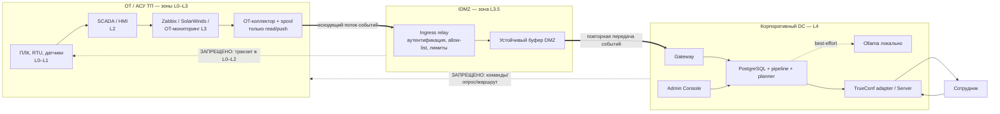
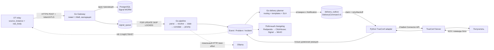

# АСУ ТП: модель потоков и изолированный контур

**Система:** платформа управления оповещениями «Диспетчер»

**Назначение документа:** проектная модель безопасного получения событий из сегментов АСУ ТП без возможности обратного управления технологическим процессом

**Статус:** рабочий архитектурный документ для согласования с владельцем АСУ ТП, ИБ, сетевой службой и эксплуатацией

**Основание:** `ALERT-PLATFORM-SPEC.md`, `ARCHITECTURE.md`, `SECURITY.md`, `INFRASTRUCTURE.md`, фактический `docker-compose.yml`, конфигурации `connectors/*.yaml`, синтетическая модель `datagen/inventory.yaml`, сценарии `p0_rig_power_loss`, `p1_switch_cascade`, `site_outage_ambiguous`, код Go gateway/pipeline/planner и Python-адаптер TrueConf.

---

## 1. Статусы утверждений и границы документа

Чтобы не смешивать демонстрационный стенд с промышленным проектом, каждое существенное положение имеет один из статусов:

| Маркер | Значение |
|---|---|
| **ФАКТ** | Подтверждено репозиторием, конфигурацией текущего стенда или приведёнными в проекте результатами испытаний. |
| **ЦЕЛЕВОЕ** | Рекомендуемое устройство промышленного контура. Оно должно быть реализовано и испытано до промышленной эксплуатации. |
| **ТРЕБУЕТ СОГЛАСОВАНИЯ** | Решение зависит от реальной топологии, принятой модели угроз, регламентов предприятия, возможностей источников или выбранных средств защиты. |

**ФАКТ.** Текущий `docker-compose.yml` описывает демонстрационный стенд на одном хосте и общей Docker bridge-сети, за отдельными исключениями. Это не реализация физически изолированного контура АСУ ТП и не доказательство соответствия требованиям IEC 62443, ФСТЭК России или отраслевым нормативам.

**ЦЕЛЕВОЕ.** Настоящий документ задаёт разделение IT/OT, промышленную DMZ (IDMZ), разрешённые потоки и эксплуатационные меры для будущего внедрения. Ссылки на Purdue Model и IEC 62443 используются только как понятийная рамка зон и каналов связи; сертификация или формальное соответствие стандарту не заявляются.

В область рассмотрения входят: контроллеры и узлы АСУ ТП как источники наблюдаемого состояния; локальные Zabbix/SolarWinds или их прокси; передача событий через IDMZ; платформа «Диспетчер»; локальная LLM; корпоративный TrueConf; администрирование, аудит, резервирование, обновление и мониторинг. Вне области — команды управления ПЛК, изменение уставок, программирование контроллеров, функции ПАЗ/ESD, команды SCADA, управление приводами и исполнительными механизмами. Платформа не должна получать такие возможности даже косвенно.

## 2. Контекст IT/OT и принцип невмешательства

**ФАКТ.** По спецификации пилот относится к Блоку разведки и добычи: четыре филиала, 87 пользователей, Zabbix и SolarWinds как пилотные источники. Синтетическая инвентарная модель включает технологические подсети, серверы, сетевые коммутаторы, буровые установки и по 3–5 контроллеров на установку. Zabbix формирует сообщения о состоянии хостов, сервисов, дисков и потере питания; SolarWinds — о состоянии сетевых узлов и интерфейсов. Все данные модели и демонстрации синтетические.

В OT-среде доступность и детерминированность технологического управления приоритетнее удобства интеграции. Поэтому «Диспетчер» рассматривается не как часть контура управления, а как **пассивный потребитель оповещений**. Он нормализует копию уже сформированного мониторингом события, коррелирует её с другими событиями, назначает приоритет и информирует человека через TrueConf. Ошибка, компрометация или остановка «Диспетчера» не должна менять состояние технологического объекта.

**ЦЕЛЕВОЕ. Базовый инвариант OT-интеграции:**

> Из OT разрешается передавать наружу только телеметрию состояния и служебные подтверждения доставки до ближайшего буфера. Из платформы «Диспетчер», TrueConf, административной сети или IT-сегмента не существует сетевого маршрута и прикладного контракта для управления технологическим процессом.

Это означает одновременно:

1. платформа не подключается к ПЛК, RTU, DCS, SCADA, инженерным станциям и промышленным протоколам;
2. в каноническом событии нет поля `command`, `setpoint`, `write`, управляющей функции или произвольного URL обратного вызова;
3. ответ сотрудника в TrueConf меняет только доменное состояние оповещения — например, подтверждение, назначение или разметку — и не транслируется в OT;
4. firewall не разрешает сессии из IT/платформы в OT;
5. компоненты DMZ не используют общую с OT учётную запись с правом изменения конфигурации;
6. отказ корреляции или ИИ ведёт к большему количеству уведомлений, но не к подавлению технологической защиты и не к воздействию на процесс.

**ФАКТ.** Текущий gateway принимает только `POST /api/v1/ingest/raw` с полями `source_system`, `source_instance`, `raw_body`, опциональным `external_id`; максимальное тело — 1 МиБ. Он записывает сырой сигнал и запись очереди в PostgreSQL. В текущем контракте нет endpoint для управления источником или технологическим объектом.

**ФАКТ.** Спецификация перечисляет HTTP webhook, syslog, SNMP trap, AMQP, SMTP и API polling как потенциальные способы подключения, но текущая реализация Go gateway фактически предоставляет HTTP ingest. Конфигурации Zabbix/SolarWinds — парсеры текстового `raw_body`, а не сетевые адаптеры SNMP/syslog.

**ЦЕЛЕВОЕ.** Для промышленного контура выбирается push-модель: локальный OT-коллектор получает событие внутри своей зоны, помещает его в устойчивый локальный spool и инициирует исходящее соединение только к relay в IDMZ. Платформа не опрашивает OT. Если источник поддерживает только API polling, опрос выполняет коллектор, размещённый **в той же OT-зоне**, с локальной read-only учётной записью; результат затем выталкивается наружу. Прямой polling из IDMZ или IT в OT запрещён.

## 3. Зоны и уровни

Ниже приведено концептуальное отображение на уровни Purdue. Уровни не заменяют фактическую инвентаризацию и категорирование объектов.

| Зона / уровень | Примеры активов | Допустимая роль в решении | Запреты |
|---|---|---|---|
| **L0 — физический процесс** | датчики, исполнительные механизмы | не взаимодействуют с платформой | любой маршрут к «Диспетчеру» |
| **L1 — базовое управление** | ПЛК, RTU, локальные контроллеры, VFD | только объект наблюдения для штатной SCADA/мониторинга | прямой доступ gateway/relay; запись регистров; изменение логики |
| **L2 — надзорное управление** | HMI, SCADA, ПАЗ-интерфейсы, инженерные станции | локально формируют состояния; напрямую данные не отдают | входящие соединения из L3.5/L4; установка агента платформы без отдельного решения |
| **L3 — OT operations** | Zabbix proxy/server для АСУ ТП, локальный журнал событий, OT-коллектор, OT NTP/DNS | собирает read-only данные, нормирует транспортный конверт, буферизует и отправляет наружу | получение команд из IT; общие админские учётные записи; доступ в интернет |
| **L3.5 — IDMZ** | пара ingress-relay, reverse proxy/API gateway, malware/update staging, bastion, DMZ NTP relay | завершает OT-сессию, проверяет источник/размер/схему, повторно передаёт событие в платформу | транзитная маршрутизация L4↔L3; хранение OT-админских секретов; бизнес-логика управления |
| **L4 — корпоративный DC / платформа** | gateway, PostgreSQL, pipeline, planner, Ollama, admin console, changelog, TrueConf adapter | приём копии события, WORM, аналитика, уведомление людей | соединения к L0–L2 и управляющие вызовы к L3 |
| **L4/L5 — пользователи и корпоративные сервисы** | TrueConf Server, LDAP/AD, SOC/SIEM, рабочие места | аутентификация, доставка уведомлений, аудит | доступ к OT через ссылки или команды бота |

**ТРЕБУЕТ СОГЛАСОВАНИЯ.** Размещение TrueConf Server и LDAP/AD в реальной сети, число IDMZ на площадках, наличие выделенного OT SOC, границы технологических сегментов, межсетевые экраны и сертифицированные средства защиты определяются владельцами инфраструктуры и ИБ.

**ЦЕЛЕВОЕ.** Для каждого филиала рекомендуется независимый OT-коллектор и локальный spool. IDMZ relay допускается центральный или площадочный — выбор зависит от WAN и требований автономности. При потере межплощадочного канала сбор на площадке продолжается без воздействия на АСУ ТП.

## 4. DFD уровня 0: доверительные границы

Ответ `202 Accepted` по HTTPS является техническим подтверждением приёма на ближайшей разрешённой границе, а не обратной управляющей командой. Межсетевой экран разрешает только пакеты уже установленной исходящей сессии. Если политика требует физической однонаправленности, HTTP с ответом неприменим как сквозной протокол: перед data diode нужен локальный proxy/spool, подтверждающий запись отправителю, а за диодом — отдельный receiver.

**ТРЕБУЕТ СОГЛАСОВАНИЯ.** Физический data diode, программно-аппаратный однонаправленный шлюз или логическая однонаправленность stateful firewall. Выбор влияет на подтверждение, повторную передачу и достижимый RPO.

## 5. DFD уровня 1: обработка события внутри платформы

**ФАКТ.** Gateway записывает Signal до разбора; уникальность по источнику и хэшу обеспечивает идемпотентность. Pipeline захватывает записи через `FOR UPDATE SKIP LOCKED`, возвращает зависшие `processing` по TTL и закрывает некоторые проблемы по TTL. Planner создаёт `Notification` и `DeliveryOutbox`, а Python consumer также использует `SKIP LOCKED`, retry/backoff и сохраняет provider `chat_id/message_id`.

**ФАКТ.** Redpanda, ClickHouse и MinIO являются downstream-контуром и не стоят на пути ingest → обработка → доставка. Недоступность MinIO проверялась без остановки ingest; это свойство следует сохранить в промышленной схеме.

**ФАКТ.** Текущий ответ пользователя TrueConf используется сценариями и меняет только данные платформы. В коде адаптера нет доступа к ПЛК/SCADA и нет бизнес-логики маршрутизации.

## 6. Матрица разрешённых потоков

Номера портов ниже — целевой профиль, если явно не указано иное. На межзоновых экранах правила задаются конкретными IP/FQDN и сервисными учётными записями, а не широкими подсетями.

| ID | Источник → назначение | Протокол / порт | Данные | Аутентификация и защита | Направление | Критичность | Логирование |
|---|---|---|---|---|---|---|---|
| F01 | OT Zabbix/SolarWinds → OT-коллектор | локальный vendor API/syslog/SNMP, порт по паспорту источника | алерты и состояния, read-only | локальная service account с минимальными правами; allow-list | внутри OT | высокая | подключения, источник, счётчик, ошибки; без секретов |
| F02 | OT-коллектор → IDMZ relay A/B | **HTTPS 443/TCP** | `{source_system, source_instance, raw_body, external_id}` | **ЦЕЛЕВОЕ:** mTLS + отдельный токен источника, TLS 1.2+ | только OT→IDMZ; ответ в established-сессии | критическая | request-id, cert subject, размер, код ответа, latency, хэш |
| F03 | IDMZ relay → DMZ spool | локальный TLS/очередь; реализация выбирается | неизменённый конверт + метаданные приёма | machine identity, шифрование at rest | внутри IDMZ | критическая | постановка/выдача, depth, age, retry, checksum |
| F04 | IDMZ relay/spool → platform gateway | **HTTPS 443/TCP**; фактически контейнер gateway слушает 8080 и опубликован как 8081 | те же события, без управляющих полей | mTLS + `X-Source-Token`; WAF/API limit | только IDMZ→L4 | критическая | полная трассировка без тела в обычном access-log |
| F05 | Gateway → PostgreSQL primary | PostgreSQL **5432/TCP** | Signal WORM и `signal_queue` | SCRAM, отдельная роль gateway, TLS | внутри L4 | критическая | DB audit, ошибки транзакций, saturation |
| F06 | Pipeline/planner/admin → PostgreSQL | PostgreSQL **5432/TCP** | нормализованные события, проблемы, инциденты, подписки, outbox | разные роли по компонентам, SCRAM, TLS | внутри L4 | критическая | логины ролей, DDL/DCL, ошибки; выборочный DML audit |
| F07 | Pipeline/planner/admin → Ollama | HTTP **11434/TCP** фактически через `host.docker.internal` | текст алерта, локальный контекст/RAG | **ЦЕЛЕВОЕ:** TLS/mTLS или изолированная service mesh; allow-list | только сервис→LLM | средняя, best-effort | latency, модель, status, token counts; не писать полный OT-текст без основания |
| F08 | Planner → delivery_outbox | транзакция PostgreSQL | `DeliveryCommand v1`, текст, получатель, idempotency | DB role planner | внутри L4 | критическая | создание команды, тип, получатель, incident-id |
| F09 | TrueConf adapter → TrueConf Server | Chatbot Connector API; фактический default **4309/TCP**, HTTP/HTTPS выбирается env | готовое уведомление, recipient, reply id | bot token/credentials, **ЦЕЛЕВОЕ:** HTTPS и проверка сертификата | L4→корпоративный TrueConf | критическая для оповещения | message-id, статус, попытка, задержка; без пароля/token |
| F10 | TrueConf Server → adapter | vendor event stream в установленной сессии | входящие команды, reply-ACK, health events | авторизованная bot-сессия | ответный прикладной поток только в L4 | высокая | sender JID, command type, correlated notification-id |
| F11 | Admin browser → Admin Console | **HTTPS 443/TCP**; фактически host 8090 | UI/API, отчёты, конфигурация | LDAP session, HttpOnly/Secure cookie, RBAC, MFA через корпоративный контур | user/admin zone→L4 | высокая | входы, отказы, изменения, session-id без cookie value |
| F12 | Admin Console/deprovision → LDAP/AD | **LDAPS 636/TCP** целевой; фактически demo `ldap://ldap:389` | bind, user/group lookup, deprovision status | service bind + user bind, TLS, least privilege | L4→directory zone | высокая | bind result, account, group changes; без паролей |
| F13 | PostgreSQL primary → replica | streaming replication **5432/TCP** | WAL/полная физическая реплика | отдельная роль replication, SCRAM, TLS, allow-list | primary→DR/replica | критическая | lag, WAL retained, reconnect, promotion events |
| F14 | changelog-worker ↔ Redpanda → ClickHouse | Kafka **9092/TCP**, ClickHouse native **9000/TCP** | `change_events.v1`, аналитическая история | **ЦЕЛЕВОЕ:** TLS/SASL и отдельные users; в demo Redpanda без auth | внутри аналитической L4-зоны | низкая для ingest | consumer lag, offsets, rejected rows |
| F15 | changelog-worker → MinIO | S3 HTTPS **443/TCP** целевой; фактически 9000/TCP | NDJSON `Signal` batches | service account, bucket policy write-only/append policy, TLS | внутри data-зоны L4 | низкая для live path, высокая для архива | object key, range IDs, checksum, retry |
| F16 | узлы зон → локальные NTP-реле | NTP **123/UDP** | время | NTS/authenticated NTP где поддерживается; allow-list | только к NTP своей зоны | высокая | offset, stratum, source changes, loss |
| F17 | платформенные компоненты → SIEM/monitoring relay | syslog TLS **6514/TCP** или HTTPS 443 | события ИБ, метрики, audit | mTLS, buffering | L4→SOC; из OT — через отдельный relay | высокая | delivery status, backlog, drop counters |
| F18 | update staging IDMZ → внутренний репозиторий OT | HTTPS 443 или контролируемый файловый шлюз | подписанные пакеты и конфигурации, без runtime-команд | подпись, хэш, malware scan, dual control | отдельное временное правило/однонаправленный перенос | высокая | заявка, владелец, хэш, подпись, время, результат проверки |

**Запрещённые потоки:** L4/TrueConf/admin → OT collector; IDMZ → PLC/HMI/SCADA; прямой OT → PostgreSQL/Ollama/TrueConf; прямой интернет → любой компонент платформы кроме отдельно опубликованного защищённого reverse proxy; исходящий интернет из OT; общий LDAP/AD trust, позволяющий корпоративному администратору автоматически администрировать ПЛК; прямой доступ пользователя к DB/Redpanda/ClickHouse/MinIO; OT source → `docker-compose` host-port 8081 без IDMZ.

## 7. Классификация и минимизация данных

Конкретные грифы должны быть сопоставлены с корпоративной политикой. До согласования используется следующая рабочая классификация:

| Класс | Примеры | Размещение | Передача / журналирование | Срок хранения |
|---|---|---|---|---|
| **К0 — открытые** | публичная документация продукта без топологии | корпоративная зона | допускается по политике | по регламенту документов |
| **К1 — внутренние** | версии приложения, обезличенные метрики, health | L4, SIEM | TLS; без секретов | по эксплуатационному регламенту |
| **К2 — конфиденциальные эксплуатационные** | `raw_body`, IP/FQDN, имена ПЛК/узлов, площадка, геотег, топология, симптомы, incident graph | только OT/IDMZ/L4 внутри предприятия | шифрование в транзите и at rest; доступ по need-to-know; тела не писать в reverse-proxy logs | **ТРЕБУЕТ СОГЛАСОВАНИЯ** с владельцем данных |
| **К3 — персональные/служебные** | ФИО, TrueConf username/JID, подписки, ACK, LDAP group membership | L4 и каталог | RBAC, аудит чтения/изменения; маскирование в выгрузках | по политике ПДн и кадровому циклу |
| **К4 — секреты и ключевой материал** | source tokens, mTLS private keys, bot/LDAP/DB credentials, session secret | vault/HSM/secret store; не БД событий и не Git | никогда не журналировать; ротация; доставка по защищённому каналу | до ротации/отзыва |

**ФАКТ.** Demo использует синтетические данные; это снижает фактическую чувствительность стенда, но не является допустимым основанием переносить demo-пароли и открытые порты в промышленную среду.

**ЦЕЛЕВОЕ.** На границе OT коллектор добавляет только необходимые идентификаторы: код источника, площадки, объекта, компонент, временную метку и исходный алерт. Дамп памяти, конфигурация ПЛК, технологическая рецептура, значения уставок, учётные данные, произвольные вложения и скрипты отбрасываются. `raw_body` считается недоверенным текстом: он не выполняется, не интерпретируется как HTML/SQL/shell и перед показом проходит экранирование согласно контексту.

**ЦЕЛЕВОЕ.** Полные тексты алертов разрешено передавать только локальному Ollama внутри предприятия. Запрещены внешние LLM API, telemetry SaaS и автоматическая загрузка crash dump во внешнее облако. Для observability предпочтительны хэш сигнала, класс симптома и incident-id вместо полного текста.

## 8. Сценарий P0: потеря питания буровой установки

**ФАКТ.** Синтетический `p0_rig_power_loss` моделирует почти одновременную потерю питания на всех контроллерах одной буровой: задержка между контроллерами 0–5 секунд, восстановление через 15–90 минут, ожидается один инцидент с `root_symptom_class=power_lost`, приоритетом P0 и немедленной доставкой. Zabbix connector распознаёт текст `Input power lost on ...` как `power_lost`. Инвентарь связывает установку, контроллеры, компоненты и геотег.

Целевой порядок обработки:

1. АСУ ТП самостоятельно обнаруживает потерю питания; ПАЗ и безопасный останов не зависят от «Диспетчера».
2. OT monitoring формирует событие. Коллектор сохраняет тело, время и устойчивый `external_id` в локальный spool.
3. Коллектор открывает mTLS-сессию **наружу** к relay. При обрыве WAN событие повторяется с тем же ID.
4. Relay проверяет identity, `source_instance`, размер, content type и rate, затем устойчиво пишет DMZ spool.
5. Gateway атомарно пишет Signal и `signal_queue`; повтор не создаёт дубль.
6. Pipeline резолвит контроллер/площадку, вычисляет P0 и объединяет близкие события в Incident, сохраняя оригинал.
7. Первое P0 не ждёт корреляционного окна; дальнейшие симптомы дополняют инцидент без шторма сообщений.
8. Planner атомарно создаёт Notification и `DeliveryCommand v1`; adapter отправляет TrueConf и сохраняет `message_id`.
9. TrueConf ACK меняет статус **только в платформе**, не подтверждает аварию в SCADA и не снимает ПАЗ.
10. Без ACK действует SLA-эскалация; восстановление создаёт CLOSURE, не редактируя отправленное P0.

При одновременных `power_lost` и `node_down` действует `site_outage_ambiguous`: наблюдения показываются как кандидаты, а LLM — только как гипотеза. Причину определяют человек и технологический регламент.

Сценарий `p1_switch_cascade` проверяет соседний случай: `node_down` коммутатора сопровождается 8–16 недоступными хостами и 3–7 сервисами, но сворачивается в один P1-инцидент без обратных команд в сеть.

## 9. Деградации, буферизация и восстановление

| Отказ | Поведение без влияния на техпроцесс | Буфер / восстановление | Сигнал эксплуатации |
|---|---|---|---|
| связь OT→IDMZ потеряна | мониторинг и управление OT продолжаются; новые события локально копятся | disk-backed spool с лимитом по объёму/времени, retry с jitter; oldest critical не удалять | alarm по age/depth и свободному диску локально в OT |
| relay A недоступен | коллектор переключается на relay B без изменения payload/id | общий кластерный либо независимые idempotent queues | endpoint health, failover count |
| L4 gateway недоступен | IDMZ подтверждает только уже устойчиво сохранённое; не теряет запись | retry с exponential backoff, dead-letter после административного порога | oldest message age, 4xx/5xx split |
| PostgreSQL недоступен | gateway не возвращает успешный ingest; OT/DMZ spool продолжает хранение | после восстановления повтор с тем же id/hash | DB availability, transaction errors |
| pipeline остановлен | Signal остаётся WORM, очередь растёт | `pending`; stuck `processing` возвращается по TTL | queue depth/age, throughput |
| один сигнал не разбирается | остальные обрабатываются; запись помечается ошибкой | исходный Signal остаётся; резервная ручная очередь | parse success и schema drift |
| Ollama недоступна/таймаут | правило И5: доставка без AI enrichment, не молчание | AI-вызов не включать в commit критического пути | AI error rate, latency, fallback count |
| planner остановлен | проблемы уже сохранены, уведомления догоняются после запуска | идемпотентное планирование/outbox | open problems without notification |
| TrueConf недоступен | outbox retry/backoff, прочие стадии продолжают работу | до 8 попыток в demo; промышленный предел и DLQ согласовать | delivery backlog, last error, SLA |
| ClickHouse/Redpanda/MinIO недоступны | live ingest и доставка не останавливаются | offsets/watermark; повтор после восстановления | lag, watermark age |
| primary PostgreSQL потерян | **ФАКТ:** replica асинхронная, promotion ручной | возможна потеря ещё не replay-нутого WAL; восстановление по runbook | replication lag и RTO drill |

**ЦЕЛЕВОЕ.** Spool рассчитывается на 72 часа пикового потока плюс 30%, имеет квоту P0/P1, шифрование, checksum, sequence и подтверждает приём только после durable-записи. Политика переполнения сохраняет P0/P1 и явно сигнализирует о потере наблюдаемости.

**ФАКТ.** В спецификации заявлена цель RPO 0 для принятых сигналов, а текущая PostgreSQL replica асинхронная. Поэтому RPO 0 при полной потере primary **не доказан**: подтверждённая primary запись может ещё не быть replay-нута на replica. Для промышленного RPO 0 нужны синхронная/кворумная фиксация либо независимая durable-копия в IDMZ/OT spool, удаляемая только после подтверждения защищённого архива; итоговая схема требует нагрузочных испытаний.

## 10. Правила межсетевого экранирования

**ЦЕЛЕВОЕ.** Политика между зонами — default deny, включая IPv6. Каждое разрешение содержит change-id, владельца, конкретные адреса, протокол, порт, направление и срок действия.

1. F02 разрешается только зарегистрированным OT-коллекторам к VIP relay; F04 — relay к VIP gateway.
2. Запрещены `any-any`, широкие destination ranges и маршрутизация OT через container host.
3. Обратный TCP-трафик — только `ESTABLISHED,RELATED`; инициирование IDMZ→OT блокируется и логируется.
4. После TLS termination на relay трафик повторно шифруется до gateway; CA разных зон разделяются.
5. Действуют лимит размера, per-source rate limit и резерв полосы для P0/P1.
6. Используются локальные DNS; прямой internet DNS запрещён. NTP/DNS не должны становиться туннелем.
7. Accept/deny, TLS failures и изменения идут в SIEM; тела и токены не логируются.
8. Временные правила автоматически истекают; после работ проверяются сессии и порты.
9. Source NAT допустим только при сохранении достоверной machine identity коллектора.
10. Фактические flows ежеквартально сверяются с матрицей, неиспользуемые правила закрываются.

**ТРЕБУЕТ СОГЛАСОВАНИЯ.** Конкретные IP/VLAN/VRF, HA firewall, IDS/IPS, ГОСТ TLS/VPN, DPI, сертификация средств защиты и допустимость mTLS определяются корпоративными стандартами и моделью угроз.

## 11. Удалённое администрирование

**ЦЕЛЕВОЕ.** Прямое администрирование OT из TrueConf, admin console и platform nodes запрещено. Для L3 collector действует отдельная процедура:

1. заявка с объектом, целью, окном и ответственными;
2. MFA через PAM/VPN;
3. bastion IDMZ → выделенный OT jump host без сквозного L4→OT routing;
4. персональная JIT/JEA-учётная запись без shared password;
5. запись сессии; dual control для критичных изменений;
6. file transfer только через шлюз обновлений;
7. автоматическое закрытие окна и отзыв credentials;
8. защищённый break-glass с двумя ответственными и последующей ротацией.

Admin Console управляет платформой, но не Zabbix/SCADA/ПЛК. Parser YAML остаётся декларативным: статическая проверка, sandbox-тест, подпись версии и rollback.

## 12. Обновления и перенос артефактов

**ЦЕЛЕВОЕ.** OT не загружает зависимости и обновления из интернета. Цепочка: внешняя зона → quarantine → проверка → подписанный внутренний репозиторий → staging IDMZ → контролируемый перенос в OT.

Артефакт имеет владельца, источник, версию, хэш, подпись, SBOM, результаты malware/vulnerability/license scan, provenance, стендовый тест и rollback. Контейнеры закрепляются digest, не `latest`; connector YAML, firewall rules и сертификаты версионируются отдельно.

Перенос идёт через файловый шлюз/носитель с повторной проверкой хэша. Входящие artifacts и исходящая telemetry не используют общий каталог/account. Секреты выдаются runtime из secret store, а demo credentials (`alert`, `alert12345`, `svc123`, `dispatcher-demo-secret`, `replicator_demo_pw`) в production запрещены.

**ФАКТ.** В Compose имеются образы с плавающим тегом, включая `glauth:latest`, и демонстрационные значения secret по умолчанию. Это приемлемо только как описание стенда и является блокером промышленного ввода без hardening.

## 13. Временная синхронизация

Корреляция использует времена источника и приёма, сценарии — интервалы секунд/минут, SLA — дедлайны, аудит — последовательность действий. Ошибка времени может неверно связать события разных объектов или скрыть задержку P0.

**ЦЕЛЕВОЕ.** В каждой зоне используется собственная доверенная иерархия времени: OT clients → OT NTP pair → разрешённое IDMZ time relay → корпоративные stratum sources. Клиенты не обращаются напрямую к интернет-NTP. Где возможно, используется NTS/authenticated NTP; на критичных узлах — аппаратный источник по корпоративному стандарту.

Контролируются offset, jitter, stratum, смена источника и потеря синхронизации. Рекомендуемые проектные пороги: предупреждение при |offset| > 500 мс, критическое событие при > 2 с; окончательные значения согласуются с технологами. Запрещён опасный `step` времени на работающем контроллере без vendor procedure; для platform nodes допустимость step/slew задаёт эксплуатационный регламент.

Событие хранит как минимум `occurred_at` источника и `received_at/ingest_ts` платформы, площадку/timezone и признак качества времени. Если время источника недостоверно, корреляция использует ingest time с явной меткой деградации; оригинальная timestamp не переписывается.

## 14. Резервирование и непрерывность

**ФАКТ.** Demo имеет один gateway, один pipeline, один planner, один TrueConf adapter и один хост; PostgreSQL primary и asynchronous replica с ручным promotion; Redpanda single-node; ClickHouse/MinIO single-node. Хотя worker безопасно масштабируется через `SKIP LOCKED`, Compose не доказывает HA.

**ЦЕЛЕВОЕ.** Минимальный производственный профиль:

- два OT-коллектора либо локальный standby на критичной площадке, независимый disk spool;
- два relay в IDMZ за локальным балансировщиком, без общей единственной точки хранения;
- не менее двух gateway и pipeline replicas в разных failure domains;
- PostgreSQL HA с проверенным автоматическим или регламентированным failover, PITR и резервными копиями вне failure domain;
- planner/outbox consumer в нескольких репликах после проверки vendor rate limits и idempotency;
- локальный TrueConf HA согласно архитектуре владельца канала;
- Ollama не обязана быть HA для безопасности: её отказ даёт non-AI fallback. Для эксплуатационной доступности можно добавить второй inference node;
- аналитический контур резервируется по своим RPO/RTO и не повышает связанность критического пути.

Целевые RTO 30 минут и RPO 0 для **принятых** сигналов из спецификации подтверждаются не схемой, а учениями: потеря WAN, заполнение spool, падение relay, primary, pipeline, TrueConf и восстановление архива. Необходимо измерять время первого P0 после восстановления, отсутствие потерь/дублей и сохранение порядка по source_instance.

## 15. Мониторинг, аудит и детектирование нарушений

Мониторинг строится по границам, а не только по контейнерам.

| Область | Обязательные показатели / события | Реакция |
|---|---|---|
| OT collector | доступность локального source, spool depth/bytes/oldest age, disk, clock offset, cert expiry | локальный alarm; P0 при угрозе потери наблюдаемости |
| IDMZ | rate по source, auth failures, schema/size rejects, retry, queue age, unexpected outbound attempts | SOC alert; блокировка с сохранением критичного потока |
| Gateway | 2xx/4xx/5xx, ingest latency, duplicate rate, DB transaction failures | scale/runbook; 401 burst — ИБ событие |
| Pipeline | queue depth/oldest age, parse success, resolver coverage, processing latency, stuck/requeued | rollback parser, fallback raw delivery |
| Correlation/P0 | time source→first notification, число связанных симптомов, ambiguous root cause | контроль SLA, ручной review ложных связей |
| Planner/TrueConf | outbox depth/age, attempts, failed/sent, message-id recording, SLA escalation | channel incident, резервный регламент оповещения |
| Identity/admin | login failures, RBAC deny, source/parser/scenario changes, deprovision lag | SIEM correlation, privileged change review |
| Data stores | replication lag, backup age/restore test, WAL/disk, Redpanda/ClickHouse/MinIO lag | DR runbook; downstream не останавливает live path |
| Network | denied IT→OT, new flow/port, TLS downgrade, cert mismatch, DNS/NTP anomaly | немедленное расследование и containment |

**ФАКТ.** Admin dashboard уже показывает очередь, parse/resolution/delivery rates, инциденты, MTTR и latency; аудит содержит отказы входа и изменения. Эти метрики полезны, но не заменяют сетевую телеметрию IDMZ, OT spool и SIEM.

Все audit records должны иметь UTC timestamp, actor/machine identity, source IP, action, object, before/after либо version, result и correlation/request-id. Токены, пароли, private keys и session cookies запрещено логировать. Для К2/К3 данных задаются маскирование, контроль выгрузок и неизменяемое хранение аудита. Доступ администратора к очистке аудита отделяется от обычного администрирования платформы.

## 16. Критерии приёмки изолированного потока

До подключения реальной АСУ ТП должны быть доказаны следующие свойства:

1. Сканирование из L4 и IDMZ не обнаруживает маршрута/порта к L0–L2; попытки фиксируются в SIEM.
2. Из OT наружу доступны только F02/F16 и отдельно утверждённые служебные потоки; интернет недостижим.
3. Источник без валидного mTLS/token отклоняется, неизвестный `source_instance` не принимается. Это жёстче текущей backward compatibility gateway, где источник без token может быть принят.
4. Повтор 10 000 одинаковых событий не создаёт 10 000 доменных проблем и не теряет оригинальный Signal согласно согласованной политике dedup.
5. Потеря WAN на 72 часа не влияет на SCADA; spool не теряет P0/P1; после связи данные догоняются идемпотентно.
6. Остановка Ollama, Redpanda, ClickHouse и MinIO не останавливает raw ingest и TrueConf fallback.
7. Падение primary и relay отрабатывается в пределах RTO/RPO; результат подтверждён сравнением source sequence/hash.
8. P0 `p0_rig_power_loss` доставляется немедленно, несёт геотег и исходный текст; ACK не создаёт трафика в OT.
9. `site_outage_ambiguous` не выдаёт гипотезу LLM как подтверждённую первопричину.
10. parser update с ошибкой откатывается, неподдающийся разбору сигнал остаётся видимым и попадает в резервный канал.
11. Секреты отсутствуют в image/Git/logs; ротация source certificate/token не останавливает все площадки одновременно.
12. Restore backup, promotion/failback, revocation cert, expiry временного firewall rule и break-glass проверены протоколом испытаний.

## 17. Допущения, решения на согласование и непроверенное

### 17.1. Принятые рабочие допущения

- Zabbix для АСУ ТП и SolarWinds для сети формируют только наблюдательные события и допускают локальный экспорт без изменения технологического процесса.
- Корпоративный TrueConf находится вне OT и не требует сетевого доступа в технологические зоны.
- Реальные ПЛК/SCADA не будут интегрироваться напрямую; OT-коллектор является единственной точкой выхода телеметрии.
- Канонический HTTP ingest сохраняется, а IDMZ relay адаптирует физический транспорт к нему.
- Идентификаторы площадки/объекта допустимо выводить в TrueConf адресатам, имеющим соответствующую зону ответственности.
- Для критического пути PostgreSQL остаётся источником истины; аналитические системы остаются downstream.

### 17.2. Требует решения владельцев

1. Физическая однонаправленность data diode или логическая однонаправленность двух firewalls.
2. Центральная или площадочная IDMZ, число relay и срок автономного spool.
3. Реальные IP/VLAN/VRF, NTP/DNS/PKI, криптографические требования и сертифицированные СЗИ.
4. Классы конфиденциальности, сроки хранения Signal/аудита/MinIO и право передачи геотега/имён объектов в TrueConf.
5. Промышленный RPO/RTO и схема PostgreSQL HA; допустимость synchronous replication.
6. Резервный канал организационного оповещения при полном отказе TrueConf — вне автоматического OT-управления.
7. Владельцы source certificates/tokens, период ротации и порядок отзыва при компрометации площадки.
8. PAM/bastion, запись удалённых сессий, break-glass и процедура переноса обновлений.
9. Нужны ли syslog/SNMP/AMQP adapters либо все источники могут отправлять через локальный HTTP collector.

### 17.3. Непроверенное на момент подготовки

- Не изучены реальные схемы сети, ACL, firewall configuration и маршруты предприятия; репозиторий содержит только Compose-сеть стенда.
- Не подтверждены vendor-настройки, версии, лицензии и security capabilities реальных Zabbix, SolarWinds, TrueConf, ПЛК, SCADA и data diode.
- Не подтверждены фактические порты и TLS-профиль TrueConf Server; в коде default 4309 и возможен HTTP, целевой документ требует HTTPS.
- Не проведены mTLS, certificate revocation, rate-limit, WAF и penetration tests для OT→IDMZ→gateway.
- Текущий gateway допускает отсутствие `X-Source-Token`, если source token не зарегистрирован; production policy «token/mTLS обязателен всегда» не реализована и не испытана.
- Demo использует `ldap://` внутри Docker, HTTP к Ollama и ряд default secrets; промышленный TLS/secret store не реализован.
- Не реализован и не измерен disk-backed OT/IDMZ spool на 72 часа; нет теста data diode и порядка восстановления после длительного разрыва.
- RPO 0 при потере PostgreSQL primary не подтверждён из-за asynchronous replication и ручного failover.
- Не проверены HA/failover gateway, relay, planner, TrueConf adapter, Redpanda, ClickHouse и MinIO в разных failure domains.
- Не подтверждён полный production pipeline для parser version signing, sandbox publication, automatic rollback и schema drift, хотя эти требования описаны в спецификации.
- Не выполнена оценка соответствия отраслевым требованиям и категорирование КИИ; использование терминов IEC 62443/Purdue не означает сертификацию.
- Сценарии и инвентарь синтетические; точность корреляции и нагрузочные характеристики на реальных OT-сообщениях не проверены.

---

**Итоговая позиция.** «Диспетчер» допустимо подключать к АСУ ТП только как пассивный downstream-потребитель через устойчивый OT-коллектор и IDMZ. Демонстрационный Compose подтверждает прикладной тракт ingest → WORM → pipeline → outbox → TrueConf и его программную изоляцию от управляющих функций, но не подтверждает промышленную сетевую сегментацию. До ввода необходимы реализация целевого профиля, заполнение матрицы реальными адресами, модель угроз, испытания отказов и совместная приёмка ИБ/АСУ ТП/сетевой эксплуатацией.
