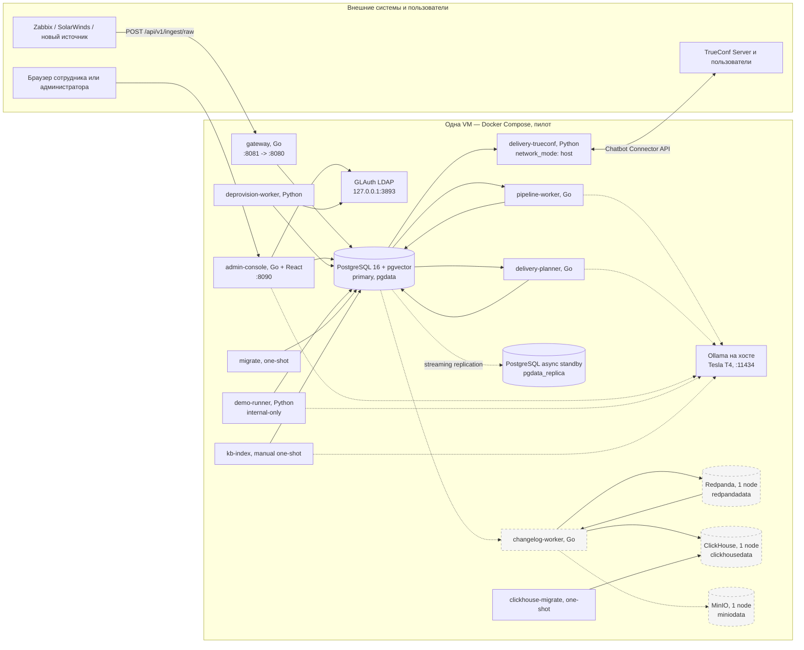
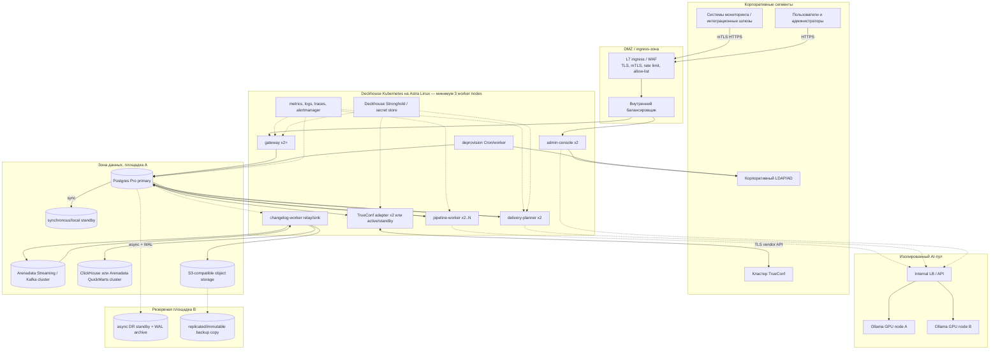

# Платформа «Диспетчер». Инфраструктурная схема

**Статус документа:** инфраструктурная концепция с фиксацией фактического пилотного развёртывания на 10.08.2026 и целевой production-топологии  
**Назначение:** основание для расчёта ресурсов, проектирования контуров dev/test/stage/prod, подготовки закупки, резервного копирования, мониторинга, эксплуатационных регламентов и приёмочных испытаний.

## 1. Правила чтения и границы достоверности

Этот документ намеренно разделяет существующий демонстрационный стенд и рекомендуемый промышленный контур. Наличие контейнера в `docker-compose.yml` означает, что компонент включён в пилотную сборку, но не означает наличия кластеризации, промышленной поддержки, автоматического переключения, резервного ЦОД или утверждённых ресурсов. Для каждого числового или архитектурного утверждения используется один из статусов:

- **ИЗМЕРЕНО** — значение получено на живой VM и зафиксировано в `INFRASTRUCTURE.md` или `PYTHON_VS_GO.md` с датой и способом измерения;
- **ОЦЕНКА** — расчёт по известной нагрузке и явно указанным допущениям; значение надо подтвердить нагрузочным испытанием и статистикой реальных данных;
- **ЦЕЛЬ** — требование или рекомендуемая характеристика промышленного контура;
- **НЕ ПОДТВЕРЖДЕНО** — необходимое свойство, для которого в репозитории и протоколах живых проверок нет достаточного доказательства.

Пилот работает с синтетическими событиями, CMDB и пользователями. Его сильная сторона — фактически работающий сквозной тракт и измеренные характеристики. Его ограничение — один физический хост, демонстрационные пароли по умолчанию, Docker Compose, общая прикладная роль PostgreSQL и ручное переключение базы. Пилот нельзя описывать как отказоустойчивый production-кластер только потому, что рядом с primary запущен контейнер реплики: потеря хоста одновременно убирает оба экземпляра, все локальные тома и прикладные процессы.

Источники фактов: `ALERT-PLATFORM-SPEC.md` (разделы 15 и 20), `alert-platform/INFRASTRUCTURE.md`, `ARCHITECTURE.md`, `SECURITY.md`, `GO-MIGRATION.md`, `PYTHON_VS_GO.md`, полный `docker-compose.yml`, Dockerfile'ы, `ops/postgres-replica/entrypoint.sh`, `database/initdb`, последовательные SQL-миграции и точки входа `go-platform/cmd/*`.

## 2. Архитектурные принципы инфраструктуры

1. **Сначала сохранить, затем обработать.** Gateway атомарно пишет сырой `Signal` и строку очереди в PostgreSQL до подтверждения приёма. Ошибка parser, resolver, коррелятора, LLM или доставки не должна уничтожать исходный факт.
2. **Критический тракт короткий.** Для приёма и доставки обязательны Gateway, PostgreSQL, Pipeline Worker, Delivery Planner, Python TrueConf adapter и TrueConf Server. Redpanda, ClickHouse, MinIO, demo-runner и Ollama не должны становиться синхронной зависимостью приёма.
3. **Stateless-процессы масштабируются отдельно от состояния.** Go gateway, pipeline и большая часть planner/admin API не хранят локальное бизнес-состояние. Конкуренция за очереди координируется PostgreSQL через транзакции, идемпотентные ключи и `FOR UPDATE SKIP LOCKED`.
4. **ИИ — best-effort.** Ollama работает внутри контура, но таймаут или отсутствие GPU деградирует необязательное пояснение, а не блокирует доставку. Для capacity planning LLM рассматривается как самостоятельный ресурсный пул.
5. **Побочная аналитика изолирована.** `changelog-worker` забирает `change_events` и `signals` после основной транзакции. Недоступность Redpanda, ClickHouse или MinIO не должна менять HTTP-ответ Gateway и статус основного outbox.
6. **Схема управляется миграциями.** Runtime не вызывает `Base.metadata.create_all()`. PostgreSQL создаётся `database/migrations/*.sql`, ClickHouse — `database/clickhouse_migrations/*.sql`; одноразовые jobs должны завершиться до запуска зависимых сервисов.
7. **Резервная копия считается только после восстановления.** Наличие `pg_dump`, реплики или S3-копии без периодической restore-проверки не является доказательством восстанавливаемости.

## 3. Фактическое демонстрационное развёртывание

### 3.1. Схема текущего стенда

**ФАКТ:** Compose публикует Gateway на всех интерфейсах хоста через `8081:8080` и Admin Console через `8090:8090`. PostgreSQL, LDAP, Redpanda, ClickHouse и MinIO опубликованы только на `127.0.0.1`. `delivery-trueconf` использует host network, чтобы обращаться к локальному TrueConf bridge. Ollama не является compose-сервисом: контейнеры достигают его через `host.docker.internal:11434`.

**РАЗРЫВ:** у большинства постоянных сервисов не задана `restart`-policy; нет reverse proxy, централизованного TLS termination, Kubernetes probes, PodDisruptionBudget, anti-affinity и оркестраторного self-healing. Живой сервер мог закрываться внешним firewall/iptables, но эти правила не версионированы в данном Compose и потому не являются воспроизводимым свойством репозитория.

### 3.2. Инвентарь сервисов

| Сервис | Режим | Назначение | Хранилище / внешняя зависимость | Масштабирование и критичность |
|---|---|---|---|---|
| `gateway` | постоянный, Go | Принимает raw events, проверяет источник, атомарно пишет WORM и очередь | PostgreSQL | критический; stateless; можно реплицировать за L7 балансировщиком |
| `pipeline-worker` | постоянный, Go | Parser, resolver, state, correlation, priority, AI enrichments | PostgreSQL, опционально Ollama | критический без ИИ; N реплик через `SKIP LOCKED` |
| `delivery-planner` | постоянный, Go | Маршрутизация, сценарии/SLA, тексты и producer `DeliveryCommand v1` | PostgreSQL, опционально Ollama | критический; транзакционная идемпотентность; multi-replica требует отдельного soak-test |
| `delivery-trueconf` | постоянный, Python | Vendor SDK, входящие команды/ACK, физическая отправка, retry | PostgreSQL, TrueConf | критический канал; outbox допускает несколько consumers, но vendor-сессии и echo-loop требуют проверки |
| `admin-console` | постоянный, Go + React | SPA, LDAP-session, API, личный кабинет | PostgreSQL, LDAP; опционально ClickHouse/Ollama/demo | не в тракте ingest; рекомендуется не менее двух реплик в production |
| `deprovision-worker` | постоянный, Python | Каждые 30 с сверяет LDAP и деактивирует подписки уволенных | LDAP, PostgreSQL | служебный; одна активная реплика либо лидерство |
| `demo-runner` | постоянный в пилоте, Python | Синтетический datagen и AI self-test | PostgreSQL, Ollama | не допускается в production либо включается только временно |
| `ldap` | постоянный GLAuth | Синтетический тестовый каталог | read-only config | только demo; production использует корпоративный LDAP/AD |
| `postgres` | постоянный | Source of truth, очереди, outbox, CMDB, pgvector | `pgdata` | критический stateful singleton пилота |
| `postgres-replica` | постоянный standby | Async physical copy для ручного recovery | `pgdata_replica` | не read scaling; на том же хосте не защищает от отказа VM |
| `migrate` | one-shot | Последовательно применяет PostgreSQL schema migrations | PostgreSQL | обязательный pre-deploy job; `restart: no` |
| `kb-index` | ручной one-shot | Индексирует Markdown knowledge base в `kb_chunks` | PostgreSQL, Ollama embeddings | запуск после изменения базы знаний; не runtime |
| `redpanda` | постоянный, 1 node | Kafka-wire транспорт `change_events.v1` | `redpandadata` | downstream; потеря не останавливает ingest, но задерживает историю |
| `clickhouse` | постоянный, 1 node | Low-code поиск по истории изменений | `clickhousedata` | downstream; Admin API деградирует по поиску |
| `clickhouse-migrate` | one-shot | Применяет ClickHouse SQL | ClickHouse | pre-deploy job; `restart: no` |
| `minio` | постоянный, 1 node | S3-архив NDJSON `raw/YYYY/MM/DD/...` | `miniodata` | downstream; тайлер повторяет попытку с watermark |
| `changelog-worker` | постоянный, Go | Postgres→Redpanda→ClickHouse и Signal→MinIO | все четыре хранилища | downstream; relay использует `SKIP LOCKED`, Data Lake — сериализованный watermark |

Go runtime images собираются multi-stage на Go 1.25 Alpine, с `CGO_ENABLED=0`, strip/trimpath и непривилегированным пользователем `app`. Admin image отдельно собирает React на Node 20 и копирует только `dist` и Go binary в Alpine. Python image основан на `python:3.11-slim`; он не задаёт отдельного `USER`, поэтому **ТРЕБУЕТСЯ ДЛЯ PRODUCTION** запуск под непривилегированным UID, read-only root filesystem и ограниченными capabilities. `web/Dockerfile` сохраняет прежнюю сборку React + Python runtime, но текущий `docker-compose.yml` его не использует: фактический `admin-console` собирается из `go-platform/Admin.Dockerfile`. Следовательно, старый Web Dockerfile нельзя принимать за описание production-процесса без отдельного решения о его удалении или актуализации.

## 4. Целевая production-топология

### 4.1. Логическая схема

Эта схема — **ЦЕЛЬ**, а не снимок текущего стенда. Product specification называет Deckhouse Kubernetes, Astra Linux, Postgres Pro, Arenadata Streaming, Tarantool, Arenadata QuickMarts, S3 storage и Stronghold как целевой стек. Текущий код уже изолирует инфраструктуру стандартными HTTP, SQL, Kafka-wire и S3 контрактами, однако совместимость с конкретными enterprise-дистрибутивами **НЕ ПОДТВЕРЖДЕНА** интеграционным испытанием. В частности, замена операционного состояния PostgreSQL на Tarantool потребует отдельной реализации persistence-интерфейса и не сводится к строке подключения.

### 4.2. Физическое размещение и failure domains

Для production минимально нужны три независимых worker-узла Kubernetes, чтобы потеря одного узла не убрала quorum системных компонентов и обе реплики одного stateless deployment. PostgreSQL primary и standby должны находиться на разных физических узлах и разных storage failure domains; DR standby — на отдельной площадке или хотя бы в отдельной зоне электропитания и хранения. GPU-узлы не должны делить ресурс с произвольным open-webui или пользовательскими моделями.

Ingress, runtime, data, AI и management образуют отдельные сетевые зоны. Kubernetes anti-affinity распределяет `gateway`, `admin-console`, planner и adapters по узлам. Stateful-хранилища не рекомендуется бездумно помещать на тот же общий thin-provisioned volume, что и контейнерные слои: для PostgreSQL критичны гарантированные IOPS, fsync и контролируемая latency, для ClickHouse — последовательная throughput, для S3 — ёмкость и erasure coding.

## 5. Нагрузочная модель и методика sizing

### 5.1. Известные величины

| Показатель | Значение и статус | Интерпретация |
|---|---|---|
| Целевая нагрузка кейса | 5 400 событий/сутки = 0,0625 события/с, **ЦЕЛЬ** | среднее почти ничего не говорит о всплеске аварии |
| Аварийный пик | 200–500 событий/мин = 3,3–8,3 события/с, **ОЦЕНКА из спецификации** | baseline для burst-теста; нужен профиль длительности |
| Gateway | 225 событий/с, **ИЗМЕРЕНО 07.08.2026** | запись WORM+queue; не предел и не SLA percentile |
| Полный pipeline | 2,5 события/с на одной реплике, **ИЗМЕРЕНО 07.08.2026** | прогон 5 302 событий за 2 095 с; исторический Python-профиль |
| Go pipeline под конкуренцией за LLM | около 1,7 события/с, **ИЗМЕРЕНО 08.08.2026** | backlog 10 488→10 388 за 60 с при совместной работе planner; не сопоставимый benchmark |
| Сквозная история в ClickHouse | около 6 с, **ИЗМЕРЕНО 10.08.2026** | при poll 2 с и лёгкой нагрузке; не p95/p99 |
| Число пользователей пилота | 87, **ЦЕЛЕВОЙ ПЕРИМЕТР КЕЙСА** | мало влияет на ingest, но влияет на fan-out и UI sessions |

Нельзя делить измеренные 225 событий/с Gateway на средние 0,0625 и объявлять весь комплекс имеющим запас 3 600×: узким местом являются синхронные LLM-вызовы, fan-out доставки и общий PostgreSQL. Также нельзя считать 2,5 события/с достаточным для пика 8,3 события/с без очереди: платформа может принять пик быстро, но backlog будет расти. Допустимость определяется временем его ликвидации и SLA доставки.

### 5.2. Сценарии baseline, peak и growth

**Baseline, ОЦЕНКА.** 5 400 событий/сутки, до 87 сотрудников, fan-out в среднем 1,5 уведомления на значимое событие, raw payload 4 КиБ. В обычный час нужны 2 gateway, 2 pipeline, 2 planner и 2 admin replicas главным образом ради доступности, а не CPU.

**Peak, ОЦЕНКА.** 500 событий/мин в течение 15 минут = 7 500 сигналов. При одной реплике с наблюдаемой скоростью 1,7–2,5/с backlog ликвидируется примерно за 50–74 минуты после окончания всплеска, если LLM и доставка не добавят новую конкуренцию. Для цели «разобрать всплеск не дольше чем за 15 минут» нужна суммарная устойчивая производительность не ниже 8,3/с, а с запасом 30% — 10,8/с. Начальный production-профиль: 4–6 pipeline replicas и отдельный лимит параллелизма LLM. Это **ОЦЕНКА**, которую должен заменить тест на одинаковом Go build с прогретой и холодной моделью.

**Growth, ОЦЕНКА.** Проектировать инфраструктуру следует минимум на 10× текущего среднего потока: 54 000 событий/сутки и пик 30–80/с при крупном каскаде или подключении нескольких дочерних обществ. Gateway такую скорость показал, но pipeline, PostgreSQL locks, pool sizes, Redpanda partitions, ClickHouse batches и TrueConf rate limits на этом масштабе **НЕ ПОДТВЕРЖДЕНЫ**.

### 5.3. Оценка диска

При 5 400 событиях/сутки получается 1,97 млн сигналов в год. Если средний `raw_body` равен 4 КиБ, только payload занимает около 7,5 ГиБ/год. С учётом строк `events/problems`, JSON, индексов, MVCC, очередей, аудита и запаса vacuum разумный planning factor для PostgreSQL — 3–4×, то есть 25–35 ГиБ/год. При 10× росте — 250–350 ГиБ/год. Средний payload, доля уведомлений и фактический bloat **НЕ ПОДТВЕРЖДЕНЫ**; через 30 дней stage/pilot надо измерить `pg_total_relation_size` по таблицам и пересчитать.

MinIO хранит NDJSON-копию сырого сигнала. Без сжатия оценка 10–15 ГиБ/год для baseline и 100–150 ГиБ/год для 10× потока, затем умножение на коэффициент репликации/erasure coding и retention. ClickHouse change history обычно компактнее row-store, но before/after JSON может доминировать; резервировать 50 ГиБ стартово и включить monthly capacity trend. WAL, backups, container logs и временное пространство миграций считаются отдельно.

## 6. Compute, RAM, disk и GPU

### 6.1. Наблюдаемый footprint пилота

**ИЗМЕРЕНО:** текущая VM имеет 16 vCPU и 62 ГиБ RAM; после добавления Redpanda и ClickHouse в момент наблюдения оставалось около 58 ГиБ. Go-процессы занимали примерно 2,7–8,7 МиБ RSS, Python-процессы — 43,9–68 МиБ. Redpanda в простое — 184 МиБ при лимите 1 ГиБ; ClickHouse — 150 МиБ при стартовой CPU-активности и лимите 1 ГиБ; MinIO — около 230 МиБ при лимите 512 МиБ; changelog-worker — 5,5 МиБ под лёгкой нагрузкой и 8,6 МиБ со всеми потоками.

Эти числа полезны как нижняя граница, но не заменяют sizing: page cache PostgreSQL/ClickHouse, compaction Redpanda, multipart uploads, backup и аварийный backlog требуют памяти и диска, которых в RSS приложения не видно.

### 6.2. Рекомендуемые resource requests/limits

| Компонент | Стартовый request, **ОЦЕНКА** | Стартовый limit, **ОЦЕНКА** | Диск |
|---|---:|---:|---:|
| gateway replica | 0,25 vCPU / 128 МиБ | 1 vCPU / 512 МиБ | ephemeral 1 ГиБ |
| pipeline replica | 0,5 vCPU / 256 МиБ | 2 vCPU / 1 ГиБ | ephemeral 2 ГиБ |
| delivery-planner replica | 0,5 vCPU / 256 МиБ | 2 vCPU / 1 ГиБ | ephemeral 2 ГиБ |
| admin-console replica | 0,25 vCPU / 256 МиБ | 1 vCPU / 1 ГиБ | static/ephemeral 1 ГиБ |
| TrueConf adapter replica | 0,25 vCPU / 256 МиБ | 1 vCPU / 1 ГиБ | ephemeral 2 ГиБ |
| changelog-worker | 0,25 vCPU / 256 МиБ | 1 vCPU / 1 ГиБ | ephemeral 2 ГиБ |
| PostgreSQL primary/standby | 4 vCPU / 16 ГиБ | 8 vCPU / 32 ГиБ | 250 ГиБ SSD минимум, 500 ГиБ recommended |
| Kafka/Redpanda node | 2 vCPU / 4 ГиБ | 4 vCPU / 8 ГиБ | 100–250 ГиБ SSD на node |
| ClickHouse node | 4 vCPU / 8 ГиБ | 8 vCPU / 16 ГиБ | 250–500 ГиБ NVMe/SSD |
| S3 node | 2 vCPU / 4 ГиБ | 4 vCPU / 8 ГиБ | по retention, от 1 ТиБ usable |

Requests — отправная точка, не закупочная гарантия. Через HPA можно масштабировать gateway по RPS/latency, pipeline — по queue age и queue depth, admin — по CPU/HTTP latency. Planner следует масштабировать по возрасту необработанных problem/scenario jobs, а не только CPU. Stateful systems масштабируются по vendor guidance после теста IOPS и recovery.

### 6.3. Ollama и GPU

**ИЗМЕРЕНО 10.08.2026:** Tesla T4 предоставляет 15 360 МиБ VRAM; модель `log-reader` 30B Q4_K_M занимает 13 860 МиБ, то есть около 90%, оставляя 1 054 МиБ. Вторая крупная модель одновременно не помещается. Конкурентные запросы pipeline и planner сериализуют инференс и уже влияли на измеренную скорость обработки. Посторонний open-webui на этом же GPU был внешне доступен и мог вытеснить модель; доступ закрыли firewall, но это подтверждает необходимость отдельного пула.

Минимум для пилота — один GPU с 16 ГиБ VRAM и явно закреплённой одной моделью; отказ переводит систему в режим без AI enrichments. **ЦЕЛЬ production:** два независимых GPU workers за внутренним балансировщиком, минимум 24 ГиБ VRAM каждый либо 48 ГиБ для более свободного размещения 30B-модели, batch/queue control, model warm-up и запрет пользовательских workloads. Точная модель GPU зависит от допустимой p95 latency, concurrency и политики качества; до benchmark нельзя обещать active-active линейное ускорение.

## 7. Тома, данные и жизненный цикл

В Compose существуют пять именованных томов: `pgdata`, `pgdata_replica`, `redpandadata`, `clickhousedata`, `miniodata`. Конфигурация LDAP, правила, connectors, runbooks, knowledge base и migrations монтируются или копируются из репозитория; они должны версионироваться в Git и поставляться immutable image/config bundle.

| Набор данных | Источник истины | Жизненный цикл и предлагаемая retention |
|---|---|---|
| `signals` | PostgreSQL WORM на уровне приложения | online 12 месяцев, затем политика архива; hard delete только по утверждённому регламенту и после доказанного архива |
| `signal_queue` | PostgreSQL | pending/processing до завершения; completed metadata 30–90 дней или партиционирование |
| events/problems/incidents | PostgreSQL | оперативная история 3 года либо по регуляторному требованию; resolved можно партиционировать по времени |
| notifications/outbox | PostgreSQL | outbox payload и ошибки 180 дней; provider IDs по сроку расследований; очистка только после сверки terminal status |
| CMDB/subscribers/subscriptions/rules/scenarios | PostgreSQL | актуальное состояние + версионированная история; soft delete предпочтительнее hard delete |
| audit/change_events | PostgreSQL + ClickHouse | не менее 1–3 лет; точный срок согласовать с ИБ; append-only/immutable sink в production |
| `kb_chunks` | PostgreSQL pgvector | производная от knowledge base; пересоздаётся `kb-index`, но snapshot ускоряет recovery |
| Redpanda topic | Redpanda/Kafka | transport retention 3–7 дней, достаточный для восстановления sink; не долговременный архив |
| ClickHouse history | ClickHouse | 1–3 года online с TTL по partitions; rebuild из source events возможен только если source retention это покрывает |
| raw archive | MinIO/S3 | 3–5 лет по согласованию; object lock/versioning, lifecycle hot→cold и запрет перезаписи |

Текущий `DataLakeSink` формирует объекты по дате выполнения архивации, а не `received_at`, и двигает единственный watermark в PostgreSQL после успешной записи. **ФАКТ:** остановка MinIO и последующий старт были проверены, ingest продолжал возвращать `202`, тайлер возобновил диапазон без потери и дублей. **РАЗРЫВ:** object lock, шифрование, checksum inventory, lifecycle rules и восстановление из NDJSON в PostgreSQL не реализованы в репозитории.

## 8. PostgreSQL: репликация, backup и восстановление

### 8.1. Текущее состояние

Primary — `pgvector/pgvector:pg16`. Инициализация пустого тома создаёт роль `replicator` и разрешает replication из compose CIDR с `scram-sha-256`. Replica entrypoint проверяет `PG_VERSION`; пустой том заполняется `pg_basebackup -R`, после чего официальный entrypoint запускает standby. Непустой том запускается повторно без нового base backup.

**ИЗМЕРЕНО 10.08.2026:** standby находился в recovery, replay lag составлял 0,591 мс, тестовая строка ingest была видна на реплике; footprint standby в простое — 19 МиБ RSS и 0,01% CPU. **ФАКТ:** promotion автоматикой не выполняется, приложение не читает standby, failover ручной. **КРИТИЧЕСКОЕ ОГРАНИЧЕНИЕ:** оба контейнера и оба локальных Docker volume находятся на одной VM, поэтому проверен отказ процесса/контейнера, но не отказ хоста или площадки.

В `INFRASTRUCTURE.md` также зафиксирован ежедневный `pg_dump` в 03:00 с хранением 7 дней и успешной пробой backup/restore на живом сервере. Скрипты расположены в домашнем каталоге сервера, а не в репозитории, поэтому расписание, внешнее размещение копии, шифрование и ежедневный контроль **НЕ ВОСПРОИЗВОДЯТСЯ** из проекта.

### 8.2. RPO/RTO

Спецификация ставит **ЦЕЛЬ** RTO 30 минут и RPO 0 для принятых сигналов. Текущий Gateway действительно подтверждает событие после записи в primary, но асинхронная replica не гарантирует, что WAL уже достиг standby. При внезапной потере primary возможна потеря небольшого хвоста подтверждённых транзакций; только ежедневный dump даёт худший RPO до 24 часов. Поэтому RPO 0 на текущем стенде **НЕ ПОДТВЕРЖДЁН**.

Production-варианты:

1. локальный synchronous standby для критичных commit с `synchronous_commit=on` — приближает RPO к нулю при отказе одного DB-node, но увеличивает write latency и не спасает от отказа общей площадки;
2. asynchronous DR standby плюс непрерывный WAL archive в независимое S3 — **ЦЕЛЬ** RPO ≤5 минут для катастрофы площадки;
3. ежедневный full/base backup и WAL/PITR, хранение daily 14 дней, weekly 8 недель, monthly 12 месяцев — **ОЦЕНКА**, окончательно определяется политикой данных;
4. ежемесячная автоматическая restore-проверка в изолированной среде и квартальное DR-учение с хронометражем.

### 8.3. Ручной failover текущего пилота

Ручное переключение выполняется только по утверждённому runbook:

1. объявить инцидент и по возможности остановить записи, чтобы исключить split-brain;
2. подтвердить недоступность primary, состояние standby и последний replayed WAL;
3. выполнить promotion standby (`pg_ctl promote` либо эквивалент в выбранном дистрибутиве);
4. изменить единую точку подключения — service/DNS/secret, а не вручную править каждый контейнер;
5. проверить `SELECT pg_is_in_recovery()`, миграционную версию, health Gateway, тестовый ingest, pipeline claim и создание outbox;
6. открыть трафик, зафиксировать фактические RPO/RTO и потерянные/повторные IDs;
7. старый primary не возвращать как primary автоматически; пересоздать его как standby от нового источника.

В текущем Compose DSN жёстко указывают DNS-имя `postgres`; процедура смены endpoint и защита от split-brain **НЕ АВТОМАТИЗИРОВАНЫ**. Для production нужен Patroni/repmgr или управляемый Postgres Pro cluster manager с fencing и виртуальным endpoint.

## 9. Горизонтальное масштабирование и очереди

Pipeline claim выбирает batch pending rows с `FOR UPDATE SKIP LOCKED`, помечает их processing и коммитит до долгой обработки. Stuck sweep через 120 с возвращает зависшие строки; TTL sweep выполняется каждые 30 с. Это позволяет N workers обрабатывать разные записи без глобальной очереди и изолирует ошибку одной записи.

TrueConf outbox consumer аналогично использует `with_for_update(skip_locked=True)`, статус processing, claimed_at, до 8 попыток и exponential backoff до 60 с. Доставка по природе at-least-once: TrueConf не предоставляет server idempotency key, поэтому crash после реальной отправки, но до commit результата может дать дубль. Код снижает риск, терминально помечая команду sent при ошибке записи результата, но нулевой дубль **НЕ ГАРАНТИРОВАН**.

`changelog-worker` relay читает `change_events` с `SKIP LOCKED`; несколько relay replicas допустимы. Sink использует Kafka consumer group. Data Lake использует одну строку watermark с `FOR UPDATE`, поэтому дополнительные replicas сериализуются и не увеличивают throughput без partitioned watermarks. Planner имеет идемпотентные ключи и lock сценарных runs, но все его ветви и SLA при N replicas должны пройти race/soak-test. Deprovision может быть singleton, потому что период 30 с не требует horizontal scaling.

Capacity controls:

- max DB connections на pod и PgBouncer перед PostgreSQL;
- bounded batch size и concurrency для LLM, TrueConf и ClickHouse inserts;
- HPA pipeline по oldest pending age и arrival/service rate;
- backpressure: Gateway продолжает durable ingest, но alert предупреждает до исчерпания диска;
- priority lanes для P0/P1, если испытание покажет, что FIFO backlog нарушает SLA; сейчас отдельные очереди по приоритету **НЕ ПОДТВЕРЖДЕНЫ**.

## 10. Redpanda, ClickHouse и MinIO как downstream-контур

Пилот использует single-node Redpanda v24.3.13, ClickHouse 24.8 и MinIO release 2025-04-08. Все порты на хосте связаны с loopback; Redpanda не имеет аутентификации, а ClickHouse/MinIO допускают demo defaults. Это приемлемо только для закрытого пилота.

`change_events` создаётся в PostgreSQL в той же транзакции, что бизнес-мутация. Relay публикует в `change_events.v1`, затем ставит `synced_at`; при ошибке строка остаётся. Такой порядок даёт at-least-once, поэтому ClickHouse sink должен быть идемпотентен по `event_id`. Raw `signals` читаются отдельно батчами по 500 и архивируются в MinIO. Gateway и pipeline не импортируют пакет changelog — изоляция подтверждается структурой кода и live-тестом отказа MinIO.

**ЦЕЛЬ production:** Kafka/Redpanda/Arenadata cluster минимум из трёх broker nodes, replication factor 3 и `min.insync.replicas=2`; ClickHouse с репликацией и backup в S3; S3 storage минимум с erasure coding, versioning/object lock, TLS и отдельным service account на bucket prefix. Если объём остаётся на уровне 5 400/сутки, экономически допустимо отложить кластер downstream и использовать PostgreSQL+S3, но это продуктовое решение, а не попытка представить single-node аналитику как HA.

## 11. Сеть, DNS, TLS и секреты

### 11.1. Матрица основных потоков

| Откуда → куда | Протокол | Разрешение в production |
|---|---|---|
| источники → ingress/Gateway | HTTPS 443 | mTLS + индивидуальный token/HMAC, IP allow-list, rate limit, body ≤1 МиБ |
| браузер → ingress/Admin | HTTPS 443 | корпоративная сеть/VPN, HSTS, secure HttpOnly cookie |
| gateway/workers/admin → PostgreSQL | TLS SQL 5432 | namespace/service-account allow-list, отдельные DB roles |
| admin/deprovision → LDAP/AD | LDAPS 636 | только каталог, bind service account, egress deny остальным |
| planner/pipeline/admin → Ollama | HTTPS internal | только AI client service accounts, timeout/circuit breaker |
| TrueConf adapter → TrueConf | vendor TLS/WebSocket | выделенная network policy и bot credentials |
| changelog-worker → Kafka | Kafka TLS/SASL | producer/consumer ACL только topic `change_events.v1` |
| changelog/admin → ClickHouse | TLS native/HTTP | insert role worker, read role admin |
| changelog → S3 | HTTPS | put/list только bucket/prefix, без root credentials |
| backup job → backup S3 | HTTPS | отдельный write-only/immutable policy |

Внутренний DNS предоставляет стабильные имена `postgres-rw`, `postgres-ro`, `ollama`, `kafka`, `clickhouse`, `s3`; адреса pod и node не попадают в application config. Публично или в корпоративной зоне публикуются только ingress endpoints. Management endpoints, database ports, Kafka, S3 console, metrics и pprof остаются в management network.

Секреты текущего Compose содержат небезопасные fallback: `alert`, `replicator_demo_pw`, `svc123`, `dispatcher-demo-secret`, MinIO root defaults. **ТРЕБУЕТСЯ ДЛЯ PRODUCTION:** убрать fallback, хранить значения в Stronghold/Vault, выдавать короткоживущие credentials где возможно, ротировать без сборки образа и не возвращать source tokens через list API. Отдельные PostgreSQL роли нужны gateway, pipeline, planner, delivery, admin, changelog и migrations.

## 12. Наблюдаемость, SLO и capacity alerts

Текущий Admin Console показывает queue depth, parse/resolution/delivery rates, AI additions, open problems/incidents, MTTR и processing latency; JSON snapshot доступен для внешнего мониторинга. Это продуктовый dashboard, но не полный инфраструктурный monitoring stack.

**ЦЕЛЕВЫЕ SLO, требуют утверждения владельцем сервиса:**

- доступность ingest API — 99,9% в месяц;
- успешная durable запись принятого запроса — 99,99%, исключая неверные/неавторизованные payload;
- p95 HTTP ingest latency ≤500 мс при baseline и peak profile;
- 99% P0/P1 сигналов проходит от `received_at` до queued notification ≤60 с без учёта недоступности TrueConf;
- 99% queued delivery commands получает terminal state ≤120 с при доступном TrueConf;
- Admin Console availability 99,5%; low-code поиск и AI-функции имеют отдельный, более мягкий SLO;
- backup success daily, restore test success monthly; replication lag p95 <5 с, alert >30 с.

Необходимые метрики: request rate/error/latency; queue depth и oldest age; обработка по stage и error class; DB connections/locks/dead tuples/WAL/replication lag; outbox pending/processing/failed/retry; TrueConf reconnect и send latency; Ollama queue, tokens/s, cold start, VRAM; Kafka consumer lag; ClickHouse insert/query latency и parts; MinIO capacity/errors; node CPU/RAM/disk/IOPS; certificate and secret expiry.

Capacity alerts рекомендуется настроить ступенчато: filesystem 70/80/90%; PostgreSQL volume forecast <60 дней; queue oldest age 30/60/300 с по priority; connection pool >80%; GPU VRAM >90% и AI queue >configured concurrency; Kafka lag >5 минут; S3 usable <20%; backup age >26 часов; replica lag >30 секунд или WAL archive failure. Alert должен вести на runbook и иметь владельца, иначе это новый источник шума.

Логи — структурированные, с correlation ID (`signal_id`, `problem_id`, `notification_id`, `outbox_id`), без raw secrets и session/token URL. Нужны централизованный сбор, retention 30–90 дней, синхронизация времени NTP и аудит действий инфраструктурных администраторов. Распределённая трассировка полезна для HTTP/SQL/LLM, но не должна передавать raw технологические payload во внешние SaaS.

## 13. Контуры dev, test, stage и prod

| Контур | Данные и назначение | Топология | Ограничения |
|---|---|---|---|
| dev | локальные синтетические fixtures, разработка | Compose, один PostgreSQL; downstream/AI по профилю | допускаются demo credentials, нет реальных данных/TrueConf production bot |
| test/CI | миграции на чистой БД, unit/integration, contract tests | ephemeral services на pipeline | детерминированность; без зависимости от общей VM и внешнего Ollama |
| stage | production-like acceptance, load/DR/security | отдельный namespace/cluster, копия topology меньшего размера | только обезличенные данные; отдельные LDAP/TrueConf accounts, secrets и DNS |
| prod | реальные сигналы и пользователи | HA topology, отдельные data/AI failure domains | deny-by-default, change control, backups, 24×7 monitoring |

Нельзя использовать одну PostgreSQL schema или общий MinIO bucket между stage и prod. Образы продвигаются по digest из CI в stage, затем тем же digest в prod; rebuilding после приёмки запрещён. Migrations проверяются на чистой и на копии существующей schema. Demo-runner, GLAuth и test recipients не включаются в production manifest.

## 14. Развёртывание, обновление и rollback

### 14.1. Пилотный Compose

Базовый порядок: собрать immutable images; поднять PostgreSQL; дождаться health; выполнить `migrate`; запустить Gateway/Pipeline/Planner/Admin/adapter; отдельно применить ClickHouse migration; затем downstream. `kb-index` запускается при изменении knowledge base. Перед переключением старого runtime процессы, удерживающие schema locks, останавливаются: при реальной миграции уже наблюдался deadlock между `ALTER TABLE` и старым pipeline.

Compose пригоден для демонстрации, но текущий файл не задаёт pin для GLAuth `latest`, restart policies, read-only FS и resource limits для большинства приложений. Для воспроизводимости все image tags должны быть фиксированы digest, а `.env` — не содержать production secrets.

### 14.2. Production rollout

1. CI выполняет Python compile/tests, Go format/test/vet, React build, Compose/config lint, SBOM и image scan.
2. На временных PostgreSQL проверяются `0000..0013` с нуля и upgrade с последнего production snapshot; ClickHouse migrations — отдельно.
3. Образы подписываются и продвигаются по digest в stage.
4. Выполняются smoke, load, failure-injection и backup/restore checks.
5. DB backup/PITR checkpoint фиксируется до schema change; migration job запускается единожды с DDL-role.
6. Stateless deployments обновляются rolling/canary с `maxUnavailable=0`, readiness и graceful SIGTERM.
7. Сверяются error rate, queue age, outbox duplicates, DB locks и business counts.

Rollback приложения — возврат предыдущего image digest при сохранённом JSON/DB-контракте. Rollback схемы не должен полагаться на destructive down migration: используется expand/contract. Сначала добавляются совместимые колонки/таблицы, затем обе версии кода, backfill, переключение чтения и только в отдельном релизе удаление. Если миграция необратима, rollback — восстановление БД/PITR с явной оценкой потери данных.

## 15. HA/DR-сценарии и runbooks

| Событие | Автоматическая реакция | Действие оператора | Целевой результат |
|---|---|---|---|
| падение gateway/pipeline pod | restart/reschedule; другие replicas продолжают | проверить crashloop и queue age | без потери Signal, backlog ликвидирован |
| Ollama/GPU недоступен | timeout, fallback без AI | изолировать GPU, проверить model server | основной pipeline и delivery продолжаются |
| TrueConf недоступен | outbox retry/backoff | проверить vendor endpoint/credentials, не чистить pending | команды доставляются после восстановления; duplicates расследуются |
| PostgreSQL primary process lost | cluster manager promotes standby | подтвердить fencing, endpoint и data loss | RTO ≤30 мин, RPO согласно режиму sync/async |
| потеря DB-host | standby на другом host | failover и rebuild failed node | нет общей точки отказа storage/host |
| потеря площадки A | DR procedure | promote DR, переключить DNS/ingress, восстановить services | RTO/RPO по DR-классу, фактически измерены |
| Redpanda/ClickHouse lost | main tract unaffected; relay backlog remains | restore cluster, replay change_events | история догоняет без влияния на ingest |
| MinIO lost | watermark не двигается | restore S3, monitor lag | архив возобновляется с последнего ID |
| испорчена схема/данные | stop writers, PITR/restore | выбрать recovery point, сверить counts | доказанный restore и audit incident |
| истёк сертификат/secret | pre-expiry alert | rotate/reload, smoke test | без аварийного простоя |

Обязательные runbooks: DB failover; PITR restore; rebuild standby; exhausted disk; queue backlog; stuck outbox; TrueConf reconnect; Ollama overload/model eviction; Kafka lag; ClickHouse failed inserts; MinIO recovery; certificate/secret rotation; rollback release; compromised service account; loss of node/zone. Каждый содержит trigger, severity, owner, prerequisites, безопасные команды, verification, rollback и коммуникацию.

## 16. Эксплуатационная RACI

| Процесс | Владелец сервиса | Platform/SRE | DBA | ИБ | Команда приложения | Владелец TrueConf/LDAP |
|---|---|---|---|---|---|---|
| SLO, capacity, budget | A | R | C | C | C | I |
| Kubernetes/hosts/network | I | A/R | C | C | I | I |
| PostgreSQL backup/failover/PITR | I | C | A/R | C | C | I |
| release и migrations | I | R | C | C | A/R | I |
| security policies/secrets | I | R | C | A | C | C |
| incident critical path | A | R | R | C | R | C |
| TrueConf/LDAP availability | I | C | I | C | C | A/R |
| DR exercise | A | R | R | C | C | C |

`R` выполняет, `A` несёт итоговую ответственность, `C` согласует/консультирует, `I` информируется. Конкретные ФИО, график 24×7, каналы связи и время эскалации **НЕ ПОДТВЕРЖДЕНЫ** и должны быть заполнены до ввода.

## 17. BOM инфраструктуры

### 17.1. Минимальный пилот / функциональная приёмка

| Позиция | Количество и конфигурация, **ОЦЕНКА** | Комментарий |
|---|---|---|
| Compute host | 1 × 16 vCPU, 64 ГиБ RAM | соответствует классу измеренной VM; не HA |
| Системный SSD | 1 × 200 ГиБ | ОС, images, logs; желательно отдельный от DB |
| Data SSD | 1 × 500 ГиБ usable | PostgreSQL/ClickHouse/Redpanda; backup не на этом диске |
| Backup storage | 1 × 1 ТиБ вне хоста | dumps/WAL/S3 copy; обязательна restore-проверка |
| GPU | 1 × NVIDIA T4 16 ГиБ или эквивалент | одна 30B Q4 модель помещается без concurrency reserve |
| Сеть | 1 Гбит/с, firewall, DNS, TLS endpoint | DB/analytics ports закрыты извне |

Этот BOM сохраняет single-host риски. Он подходит для демонстрации, dev/stage малой нагрузки и проверки функций, но не для production с заявкой на RTO 30 минут после отказа VM.

### 17.2. Рекомендуемый production baseline

| Позиция | Количество и конфигурация, **ОЦЕНКА** | Назначение |
|---|---|---|
| Kubernetes worker | 3 × 8–16 vCPU, 32–64 ГиБ RAM, 200 ГиБ local SSD | stateless runtime, observability, anti-affinity |
| PostgreSQL nodes | 2 × 8 vCPU, 32 ГиБ RAM, 500 ГиБ enterprise SSD | primary + local synchronous standby |
| DR PostgreSQL | 1 × 8 vCPU, 32 ГиБ RAM, 500 ГиБ SSD на площадке B | async DR/PITR target |
| Kafka/streaming | 3 × 4 vCPU, 16 ГиБ RAM, 250 ГиБ SSD | RF=3 downstream history bus |
| ClickHouse | 2–3 × 8 vCPU, 32 ГиБ RAM, 1 ТиБ SSD/NVMe | replicated analytics; число зависит от SLA поиска |
| S3 storage | 4 × nodes/disks, 4 ТиБ raw суммарно минимум | erasure coding, raw archive и backup; usable зависит от схемы |
| GPU workers | 2 × 8 vCPU, 32 ГиБ RAM, GPU 24–48 ГиБ VRAM | isolated Ollama active-active/standby |
| Management/backup | 1–2 nodes либо общеплатформенный сервис | registry, monitoring, backup controller, bastion |
| Сеть | redundant 10 Гбит/с data; 1 Гбит/с management | VLAN/VRF, load balancers, firewall, NTP/DNS |

Это не финальная смета: конкретные серверы, RAID, IOPS, лицензии enterprise-дистрибутивов, поддержка и запасные части определяются после 30-дневной статистики, одинакового load test и vendor sizing. При малом объёме Kafka/ClickHouse/S3 могут быть общеплатформенными сервисами, а не выделенными узлами проекта.

## 18. Приёмочный checklist

### 18.1. Функциональность и производительность

- [ ] 5 400 событий/сутки и burst 500/мин приняты без потери; сверены source count, `signals`, queue, events, problems, notifications и outbox.
- [ ] p50/p95/p99 ingest и end-to-end latency измерены отдельно с включённым/выключенным и холодным/прогретым Ollama.
- [ ] Горизонтальный запуск 2, 4 и 6 pipeline replicas не создаёт двойной обработки и линейно снижает queue age до DB/LLM bottleneck.
- [ ] TrueConf fan-out и rate limits проверены на согласованном числе получателей; duplicates и at-least-once edge case отражены в отчёте.
- [ ] Отказ Ollama, ClickHouse, Redpanda и MinIO не меняет успешный durable ingest и основной delivery path.

### 18.2. Надёжность данных

- [ ] PostgreSQL standby размещён на другом host/failure domain; измерены lag, promotion и rebuild.
- [ ] Full backup + WAL/PITR восстановлены в чистую среду; сверены schema version, row counts и sample hashes.
- [ ] Выполнено контролируемое failover-упражнение; RPO/RTO зафиксированы, а не заявлены по конфигурации.
- [ ] S3 archive имеет versioning/object lock/checksum inventory и независимую копию; выполнена пробная обратная загрузка NDJSON.
- [ ] Retention/partitioning/vacuum проверены на годовом синтетическом объёме.

### 18.3. Безопасность и эксплуатация

- [ ] Нет demo passwords/fallbacks; секреты приходят из vault, ротация проверена без пересборки image.
- [ ] Ingress использует TLS, mTLS для источников, allow-list и rate limit; внутренние DB/Kafka/S3 endpoints не опубликованы пользователям.
- [ ] Сервисы работают под отдельными непривилегированными UID и DB roles; network policies deny-by-default.
- [ ] Images закреплены digest, имеют SBOM/signature и прошли vulnerability scan.
- [ ] Метрики, логи, alerts и dashboards покрывают SLO; каждый paging alert связан с runbook и on-call owner.
- [ ] Runbooks failover, restore, backlog, channel outage, secret rotation и rollback пройдены людьми, которые будут дежурить.
- [ ] RACI заполнена ФИО/подразделениями, согласованы окна работ, эскалации и коммуникации.

## 19. Неподтверждённые вводные и решения до production

1. Не измерены средний/95-й размер raw payload, фактический fan-out, месячный рост PostgreSQL/ClickHouse/MinIO и требуемый срок хранения; все дисковые оценки предварительные.
2. Нет сопоставимого benchmark текущего Go pipeline при 1/2/4/6 replicas и фиксированном режиме Ollama. Измерения 2,5 и 1,7 события/с выполнены при разных условиях.
3. Не подтверждены p95/p99 latency, длительность аварийного burst, TrueConf throughput/rate limits и время холодной загрузки модели в целевом железе.
4. RPO 0 не доказан: standby асинхронный и находится на той же VM; backup scripts и cron живого сервера не версионированы в репозитории.
5. Не реализованы автоматический DB failover, fencing, единый writable endpoint и проверенный DR на второй площадке.
6. Не подтверждена совместимость приложения с Postgres Pro, Arenadata Streaming, QuickMarts, Deckhouse/Stronghold и Astra Linux реальным стендом. Замена PostgreSQL state на Tarantool потребует разработки.
7. Нет production manifests/Helm charts, PodDisruptionBudget, anti-affinity, resource requests/limits, HPA, probes и restart policy, которые соответствуют целевой схеме.
8. Нет утверждённых SLO, retention, on-call/RACI, перечня runbooks, сертификатной схемы и enterprise BOM с ценами/лицензиями.
9. Не проверены кластерные режимы Redpanda/ClickHouse/MinIO, их backup/restore и идемпотентность ClickHouse sink при replay на большом объёме.
10. Текущий пилотный single-host остаётся функциональным доказательством и источником измерений, но не доказательством production HA.

## 20. Ссылки на технические источники

- `ALERT-PLATFORM-SPEC.md`, раздел 15 — два стека, расчёт нагрузки, целевые RTO/RPO; раздел 20 — эксплуатационные риски.
- `alert-platform/INFRASTRUCTURE.md` — живые измерения throughput, replica lag, memory/CPU, GPU и downstream failure test.
- `alert-platform/ARCHITECTURE.md` — компоненты, critical path и downstream boundary.
- `alert-platform/SECURITY.md` — опубликованные порты, LDAP, secrets и остаточные риски.
- `alert-platform/GO-MIGRATION.md` и `PYTHON_VS_GO.md` — фактическая граница Go/Python, outbox, измерения образов/RSS и ограничения миграции.
- `alert-platform/docker-compose.yml`, `Dockerfile`, `go-platform/Dockerfile`, `go-platform/Admin.Dockerfile`, `web/Dockerfile` — воспроизводимая пилотная топология и сборка.
- `alert-platform/database/migrations`, `database/clickhouse_migrations`, `database/initdb`, `ops/postgres-replica` — схема, репликация и lifecycle пустого тома.
- `alert-platform/go-platform/cmd/*`, `internal/pipeline`, `internal/planner`, `internal/changelog`, `services/delivery_trueconf/outbox.py` — runtime loops, locking, retry и graceful shutdown.
