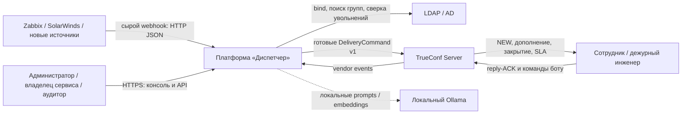
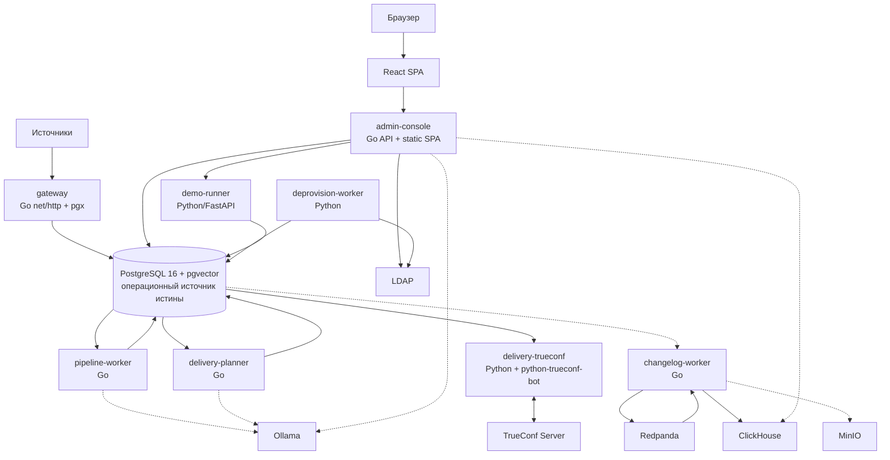
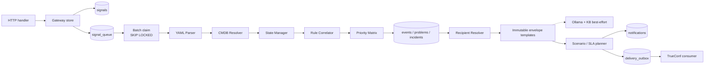
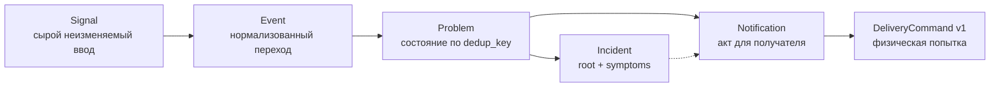
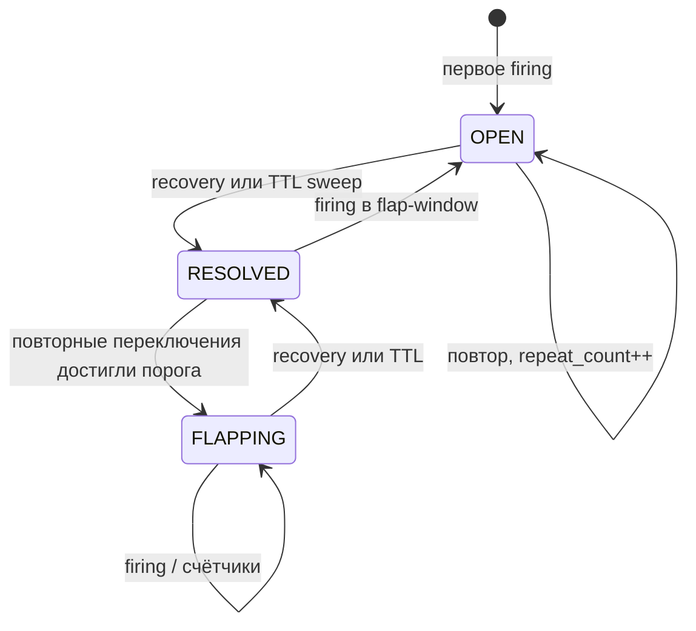
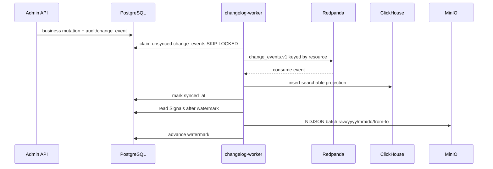

# Общая концептуальная схема приложения «Диспетчер»

## 1. Назначение документа и правила чтения

Этот документ задаёт единую системную модель платформы управления оповещениями «Диспетчер»: зачем существует система, из каких исполняемых компонентов она состоит, как проходит информация от сигнала мониторинга до реакции сотрудника, где находятся источники истины и как решение ведёт себя при сбоях. Документ самостоятельный: он объединяет продуктовые инварианты, фактически реализованную архитектуру и целевое развитие, но не подменяет детальные документы по безопасности, сетям, инфраструктуре и лицензированию.

Для исключения двусмысленности используются три метки:

- **ФАКТ** — поведение подтверждается текущим кодом, SQL-миграциями или `docker-compose.yml`;
- **ЦЕЛЕВОЕ** — согласованное требование или направление архитектуры, которое должно определять последующие изменения;
- **РАЗРЫВ** — отличие текущей реализации от целевого состояния либо ограничение пилота.

Главный предмет системы — не пересылка сообщений, а управляемое преобразование разноформатных технических фактов в адресные, объяснимые и надёжно доставленные уведомления. Платформа должна уменьшить шум, не создавая «молчаливых зон»: потеря или ошибка интеллектуального компонента не может стать причиной исчезновения исходного алерта.

## 2. Миссия, ограничения и архитектурные инварианты

Исходная задача: семь систем мониторинга создают около 5400 событий в сутки; данные приходят в разных форматах, значительная часть срабатываний самовосстанавливается без реакции, а критичные отказы могут оставаться незамеченными. «Диспетчер» принимает эти потоки, нормализует их, связывает с объектами и сервисами, ведёт состояние проблем, коррелирует каскады, вычисляет приоритет и адресатов, после чего доставляет сообщения в обязательный корпоративный канал TrueConf и предоставляет операционный веб-интерфейс.

Архитектура подчинена пяти инвариантам из спецификации.

1. **Неизменяемость доставленного.** Уже отправленное доменное уведомление не редактируется и не удаляется. Развитие ситуации выражается новым сообщением `SUPPLEMENT`, `REPEAT`, `ESCALATION` или `CLOSURE`.
2. **Неизменяемость оригинала.** Сырой текст источника сохраняется и включается в сообщение дословно; шаблон и ИИ могут формировать только обвязку.
3. **Ненулевая доставка.** Свёртка, дедупликация и корреляция не должны превращать событие в необъяснимое исчезновение. Для спорных и нерезолвленных случаев нужен резервный путь.
4. **Объяснимость.** Для решения о доставке или недоставке должна восстанавливаться цепочка: источник, парсер, объект, проблема, правило, приоритет, подписка, получатель, команда доставки и результат провайдера.
5. **Деградация в сторону шума.** Недоступность ИИ или аналитического контура не останавливает основной тракт. Безопасный результат — менее интеллектуальная, но состоявшаяся доставка.

**ФАКТ.** Go gateway атомарно сохраняет `signals` и `signal_queue`; pipeline сохраняет нормализованный `events` и состояние `problems`; planner одной транзакцией создаёт `notifications` и `delivery_outbox`; Python-адаптер отправляет готовую команду через TrueConf SDK. Локальный Ollama вызывается best-effort. Redpanda, ClickHouse и MinIO вынесены в downstream-контур.

**РАЗРЫВ.** Семантика WORM обеспечивается дисциплиной приложения и отсутствием обновлений `signals` в основном коде, но SQL-схема пилота не запрещает `UPDATE`/`DELETE` на уровне роли или триггера. Полная гарантия неизменяемого архива требует отдельных прав БД, хранения с retention lock либо эквивалентного организационно-технического контроля.

## 3. Контекст системы: C4 Level 1



Граница «Диспетчера» включает прикладные Go- и Python-процессы, React SPA, операционную PostgreSQL, очередь доставки и побочные хранилища истории. Zabbix, SolarWinds, LDAP/AD, TrueConf Server и локальный Ollama рассматриваются как внешние системы, даже если физически развёрнуты в том же закрытом контуре.

Основные акторы:

| Актор | Цель | Основная точка контакта |
|---|---|---|
| Источник мониторинга | надёжно передать исходный факт и быстро получить подтверждение | Go gateway, `POST /api/v1/ingest/raw` |
| Дежурный инженер | получить только относящиеся к зоне ответственности события, подтвердить реакцию, запросить анализ | TrueConf и персональные ссылки |
| Сотрудник | управлять подписками, видеть свои текущие алерты | личный кабинет `/me/{username}/`, `/alerts/{username}/` |
| Владелец сервиса | контролировать адресатов, SLA и качество реакции | React-консоль |
| Администратор источников | регистрировать инстансы и токены, контролировать качество разбора | экраны «Источники», «Интеграции» |
| Администратор маршрутизации | управлять сотрудниками, группами, зонами оборудования, сценариями и SLA | React-консоль и Go Admin API |
| Аудитор | исследовать действия и структурированную историю изменений | `audit_log`, `change_events`, ClickHouse-поиск |

## 4. Контейнерная модель: C4 Level 2



**ФАКТ.** Постоянные процессы Compose: `gateway`, `pipeline-worker`, `delivery-planner`, `admin-console`, `delivery-trueconf`, `deprovision-worker`, `demo-runner`, `changelog-worker`; инфраструктурные сервисы: primary и асинхронная read-only replica PostgreSQL, LDAP-сервер GLAUTH, Redpanda, ClickHouse, MinIO. `migrate` и `clickhouse-migrate` — одноразовые задачи; `kb-index` запускается для индексации базы знаний.

**ФАКТ.** Реплика PostgreSQL демонстрирует резервирование, но приложение в штатном режиме к ней не обращается; автоматический failover отсутствует, promotion ручной.

**ЦЕЛЕВОЕ.** В промышленном контуре stateless-компоненты масштабируются горизонтально, PostgreSQL заменим на Postgres Pro, Kafka-совместимый интерфейс — на отечественную платформу потоковой обработки, S3 — на on-premise хранилище, Compose — на Kubernetes/Deckhouse. Прикладные контракты HTTP, SQL, Kafka wire и S3 должны сохранять заменяемость.

## 5. Карта владения реализацией

| Зона ответственности | Владелец сегодня | Код / артефакт | Что не должно проникать в зону |
|---|---|---|---|
| Приём HTTP, валидация, токен источника, дедупликация Signal | Go | `internal/gateway` | парсинг, маршрутизация, TrueConf SDK |
| Parser, resolver, lifecycle Problem, correlation, priority, AI enrichment | Go | `internal/pipeline` | отправка сообщений и UI |
| Маршрутизация, шаблоны, RAG/LLM, сценарии, SLA, outbox producer | Go | `internal/planner`, `internal/scenario` | vendor API TrueConf |
| LDAP login, session-cookie, Admin API, персональный кабинет, аналитика | Go | `internal/adminapi` | расчёт pipeline и физическая доставка |
| Структурированная история и data lake relay | Go | `internal/changelog`, отдельные `cmd` | блокирование основного тракта |
| Веб-интерфейс | React/TypeScript | `web/src` | прямой доступ к БД |
| TrueConf connection, vendor events, создание личного чата, send/retry | Python | `services/delivery_trueconf` | маршрутизация, сценарии, формирование доменного текста |
| LDAP deprovision sweep | Python | `services/deprovision` | остановка pipeline при недоступности каталога |
| Синтетические сценарии и AI self-test | Python | `services/demo`, `datagen` | production-решения по реальным событиям |
| Схема данных | SQL-миграции | `database/migrations` | `create_all()` из runtime-кода |

Эта карта — архитектурное ограничение. Старые Python-модули gateway/pipeline/API могут оставаться для истории и тестовой совместимости, но не являются местом новой production-логики. TrueConf намеренно остаётся на Python, потому что специализированная vendor-библиотека `python-trueconf-bot` определяет транспорт и типы входящих событий.

## 6. Компонентная модель критического тракта: C4 Level 3



Gateway не разбирает предметный смысл сообщения. Он ограничивает тело одним мегабайтом, запрещает неизвестные JSON-поля и NUL в `raw_body`, проверяет обязательные строки, опционально сравнивает `X-Source-Token` в constant time, вычисляет SHA-256 тела и начинает транзакцию. В ней создаётся `signals`; уникальность `(source_instance, hash)` возвращает статус `duplicate` для повтора; для нового сигнала создаётся `signal_queue(pending)`. HTTP 202 выдаётся только после commit.

Pipeline конкурентно выбирает до 20 записей `pending` через `FOR UPDATE SKIP LOCKED`, переводит их в `processing`, а затем обрабатывает каждую в собственной транзакции. YAML-коннектор выбирается по `source_system`; parser формирует нормализованный Event; неизвестный класс симптома может быть best-effort классифицирован локальной моделью. Resolver связывает объект по CMDB. State manager блокирует последнюю Problem по `dedup_key`, создаёт, повторяет, переоткрывает или закрывает её. Приоритет рассчитывается из технической важности и критичности затронутых сервисов. Коррелятор применяет активные правила и создаёт Incident с root/symptom связями. Только после успешной записи Event и статуса очереди `done` транзакция фиксируется.

Planner периодически читает открытые Problem, определяет активных получателей из подписок, владения и сервисов, создаёт `NEW`; для разрешённых Problem планирует `CLOSURE`; для нового состава Incident — `SUPPLEMENT`; отдельно исполняет графы сценариев, SLA и очередь запросов ИИ-анализа. Шаблон сообщения всегда берёт исходный `signals.raw_body` через Event. `notifications` и соответствующая команда `delivery_outbox` создаются атомарно.

Python consumer захватывает готовые команды `pending` с `SKIP LOCKED`, при необходимости вызывает `create_personal_chat`, отправляет `text` и сохраняет `provider_chat_id`, `message_id`, статус и время. Он не читает CMDB и не решает, кому отправлять.

## 7. Каноническая доменная модель



### 7.1. Signal

Signal отвечает на вопрос «что и когда фактически принял шлюз». Поля: система и инстанс источника, внешний идентификатор, время приёма, дословное тело, SHA-256. Это слой доказательства и повторной обработки. Дедупликация по инстансу и хэшу не позволяет одному точному телу породить несколько очередных элементов.

### 7.2. Event

Event отвечает на вопрос «какой нормализованный переход состояния выражал Signal». Он append-only по смыслу и содержит `state` (`firing` или восстановление), `occurred_at`, `ingest_ts`, класс симптома, исходную severity, заголовок, объектные признаки, версию parser, результат resolver и ссылку на Problem. Раздельные времена нужны для контроля дрейфа часов источника.

### 7.3. Problem

Problem — живущее во времени состояние одного симптома конкретного компонента объекта. Ключ строится концептуально как SHA-256 площадки, объекта, компонента и класса симптома; источник не входит в ключ, чтобы один физический факт от Zabbix и SolarWinds мог быть распознан как единая проблема. Problem содержит repeat/toggle counters, приоритет и его breakdown, связь с Incident, возможный дубль, ИИ-гипотезу и данные ACK.

Фактический lifecycle поля `problems.status`:



**ФАКТ.** ACK в текущей реализации — ортогональный признак, а не переход показанного автомата: reply-handler записывает `acknowledged_at/by`, не меняя `status`, а сценарии воспринимают наличие timestamp как факт реакции. Основной state manager непосредственно переводит firing/recovery между `OPEN`, `FLAPPING`, `RESOLVED`; значение `ACKNOWLEDGED` поддерживается частью запросов как активное для совместимости с расширенной моделью.

**РАЗРЫВ.** Целевая диаграмма ТЗ содержит также `SUPPRESSED`, а управляемые режимы подписки предполагают digest/on-demand/critical-only. В текущей схеме полной lifecycle-семантики подавления и всех режимов нет.

### 7.4. Incident

Incident — кластер связанных Problem: одна корневая и ноль или более симптоматических. `incident_problems` хранит роль и идентификатор правила. Incident возникает только при срабатывании корреляции; одиночная Problem может законно не иметь Incident. Это важное отличие от интерфейсного названия «инцидент»: в БД не каждый алерт оборачивается отдельным Incident.

### 7.5. Notification и DeliveryCommand

Notification — доменный акт коммуникации с конкретным получателем; текущая FK ведёт к Problem, а Incident доступен через неё. Статусы отражают планирование и результат, `message_id` связывает ответ TrueConf с исходной Problem. DeliveryCommand v1 — версия физического контракта: `contract_version=1`, `notification_id`, канал `trueconf`, стабильный `idempotency_key`, адрес (`recipient` или `provider_chat_id`), текст, parse mode и опциональная ссылка на родительское уведомление.

**РАЗРЫВ.** Спецификация концептуально определяет Notification через Incident, а реализация — через Problem. Для пилота это позволяет одинаково уведомлять как одиночные Problem, так и коррелированные, но аналитика «одно уведомление на Incident» требует явно учитывать эту разницу.

## 8. Bounded contexts и источники истины

| Контекст | Команды / решения | Источник истины | Публичная граница |
|---|---|---|---|
| Ingestion | принять или признать точным дублем | `signals`, `signal_queue` | Raw Ingest API |
| Normalization | разобрать, сопоставить объект, обновить Problem | `events`, `problems`, CMDB, YAML connectors | очередь PostgreSQL |
| Correlation | выбрать root и связать symptoms | `correlation_rules`, `incidents`, `incident_problems` | внутренняя транзакция pipeline |
| Routing | вычислить получателей | `subscriptions`, `subscribers`, ownership/services/groups | функции planner |
| Automation | вести граф сценария и SLA | `scenarios`, version snapshots, runs/steps, `sla_rules` | Admin API + planner tick |
| Delivery | подготовить и физически отправить | `notifications`, `delivery_outbox` | DeliveryCommand v1 |
| Identity | аутентифицировать и деактивировать ушедших | LDAP/AD — истина о составе; PostgreSQL — профиль приложения | LDAP bind/search, session cookie |
| Administration | справочники и конфигурация | PostgreSQL + SQL migrations | Go Admin API |
| History | хранить before/after и искать изменения | PostgreSQL `change_events`; ClickHouse — производная копия | changelog wire event, search API |
| Raw archive | долговременно копировать Signals | PostgreSQL — первичный WORM-журнал; MinIO — downstream archive | S3-compatible objects |

Изменение схемы разрешено только последовательной SQL-миграцией. Runtime не вызывает `Base.metadata.create_all()`. `0000_baseline.sql` фиксирует исходные таблицы, последующие миграции добавляют outbox-защиты, группы, AI requests, pgvector KB, токены источников, историю изменений, watermark и версионированную трассу сценариев.

ClickHouse не является источником операционного состояния. Карточки оборудования и сотрудников читают историю из PostgreSQL; ClickHouse обслуживает кросс-сущностный low-code поиск. MinIO не заменяет `signals`, а архивирует их по монотонному watermark. Redpanda не находится между gateway и pipeline.

## 9. Сквозной поток: ingest → доставка → ACK

```mermaid
sequenceDiagram
    participant M as Monitoring
    participant G as Go Gateway
    participant DB as PostgreSQL
    participant P as Go Pipeline
    participant R as Go Planner
    participant T as Python TrueConf
    participant U as Engineer

    M->>G: POST /api/v1/ingest/raw
    G->>DB: BEGIN; INSERT Signal; INSERT signal_queue
    DB-->>G: COMMIT
    G-->>M: 202 queued / duplicate
    P->>DB: claim pending SKIP LOCKED
    P->>DB: parse + Event + Problem + Incident; COMMIT
    R->>DB: load Problem + CMDB + subscriptions
    R->>DB: BEGIN; Notification + DeliveryCommand v1; COMMIT
    T->>DB: claim outbox SKIP LOCKED
    T->>T: create/reuse personal chat
    T->>U: send_message(NEW)
    T->>DB: message_id, chat_id, sent
    U->>T: reply to NEW
    T->>DB: find Notification(message_id); set acknowledged_at/by
    R->>DB: scenario ACK branch / cancel SLA response breach
```

Транзакционные границы существенны. Источник получает подтверждение после сохранения, а не после полной обработки. Поэтому временная остановка pipeline увеличивает глубину очереди, но не заставляет мониторинг повторять принятый факт. Создание Notification не отделено от outbox: невозможна ситуация, когда пользовательская коммуникация запланирована, но команда потеряна между таблицами.

Reply в TrueConf сопоставляется по `reply_message_id` с `notifications.message_id` типа `NEW`; первый ответ фиксирует ACK. Ответ со словом «анализ» дополнительно создаёт `ai_analysis_requests`, а planner позже отправляет результат отдельным сообщением. Команды `/кабинет`, `/алерты`, `/сводка` формируют персональные ссылки или дневную сводку.

**РАЗРЫВ.** Сейчас любой reply на NEW означает бинарную реакцию; отдельные доменные исходы `взял`, `не мой`, `следствие` и создание корреляционного правила из диалога не реализованы полностью. Для целевого состояния Python должен только преобразовать vendor event в явный входящий контракт, а бизнес-правило исполнить Go core.

## 10. Поток истории изменений



`audit_log` остаётся простым журналом действий для операционного экрана. `change_events` хранит actor, роль, action, resource type/id, before/after JSON, result и detail. Relay работает at-least-once: при сбое продюсера строка остаётся несинхронизированной и повторяется. Ключ Kafka `resource_type:resource_id` сохраняет порядок изменений одной сущности. Data lake sink блокирует единственную строку watermark, формирует NDJSON-батч и продвигает отметку после успешной загрузки объекта.

**ФАКТ.** Отказ Redpanda, ClickHouse или MinIO не должен влиять на ingest и доставку, потому что ни gateway, ни pipeline, ни planner не вызывают эти системы.

**РАЗРЫВ.** `changelog.Record` иногда вызывается как best-effort отдельным запросом, а иногда внутри транзакции мутации. Для строгой полноты аудита все существенные административные изменения должны записывать `change_events` в одной транзакции с изменяемой сущностью.

## 11. API surface и пользовательские интерфейсы

### 11.1. Gateway API

| Метод | Назначение | Статус |
|---|---|---|
| `POST /api/v1/ingest/raw` | L0: сырой Signal `{source_system, source_instance, raw_body, external_id?}` | **ФАКТ** |
| `GET /api/v1/health` | БД и глубина pending queue | **ФАКТ** |
| `GET /openapi.json`, `GET /docs` | локальная документация без CDN | **ФАКТ** |
| `POST /api/v1/events` | приём канонического Event | **ЦЕЛЕВОЕ / РАЗРЫВ** |

Для зарегистрированного инстанса с `api_token` обязателен `X-Source-Token`. Неизвестный инстанс или старый инстанс без токена допускается ради обратной совместимости — это осознанный риск пилота.

### 11.2. Admin API

Go admin-console обслуживает LDAP login/logout/current user; summary и analytics; списки и карточки incidents/alerts; CRUD сотрудников и оборудования; availability; группы, членов и equipment scope; сценарии, версии, activation/deactivation и трассы; SLA; integrations; sources; audit; историю изменений; персональные subscription suggestions. Большинство `/api/*` требует подписанную HttpOnly session-cookie. Источники и аудит дополнительно проверяют admin-признак. Публичным оставлен compliance endpoint и экран для проверяющего.

Отдельные token-based HTML-маршруты `/me/{username}/` и `/alerts/{username}/` предназначены для перехода из TrueConf. В React SPA реализованы маршруты: главная, инциденты и карточка, алерты, оборудование и карточка, сотрудники и карточка, группы, сценарии и редактор, SLA, аналитика, интеграции, источники, аудит, история изменений, demo и compliance.

### 11.3. TrueConf surface

Фактически поддержаны `/старт`, `/кабинет`, `/алерты`, `/сводка`, reply-ACK и reply-запрос «анализ». Физический адаптер использует личные чаты и HTML-сообщения; provider `chat_id/message_id` сохраняются. Целевые команды `/граф`, `/связать`, полноценные `взял`, `не мой`, `следствие` остаются расширениями.

## 12. Конкурентность, идемпотентность и семантика доставки

Система использует единый паттерн «PostgreSQL как надёжная очередь»: короткая транзакция выбирает ограниченный batch с `FOR UPDATE SKIP LOCKED`, отмечает ownership записи, обработчик выполняет работу, а зависший `processing` возвращается по TTL. Это позволяет запускать несколько реплик без глобальной блокировки.

| Участок | Защита | Семантика |
|---|---|---|
| Ingest | unique `(source_instance, hash)` | точный повтор тела не создаёт новый Signal |
| Signal queue | claim batch + stuck timeout | повторная обработка после падения; транзакционная запись Event/Problem |
| Problem state | `SELECT latest ... FOR UPDATE` по `dedup_key` | сериализация перехода одного состояния |
| Scenario run | unique `(scenario_id, problem_id)`, `FOR UPDATE SKIP LOCKED`, pinned version | одна логическая траектория и воспроизводимая версия графа |
| Planner/outbox | stable unique `idempotency_key` + unique notification command | один тип сообщения одному recipient для Problem/шага |
| TrueConf consumer | claim/retry/backoff/max attempts | at-least-once около границы внешнего API |
| Change relay | unsynced rows + SKIP LOCKED | at-least-once в Redpanda/ClickHouse |
| Data lake | singleton watermark locked in transaction | последовательные непересекающиеся батчи |

Критическая оговорка: TrueConf не принимает server-side idempotency key. Если сообщение реально отправлено, но процесс падает до фиксации результата в PostgreSQL, повтор может создать дубль. Адаптер старается терминально пометить команду `sent` даже при частичной ошибке сохранения, но абсолютно exactly-once через внешний API недостижим без поддержки провайдера. Требуются метрика таких случаев и процедура ручной сверки.

## 13. ИИ как необязательный советчик

Ollama развёрнут локально и вызывается по HTTP из pipeline, planner и admin-console. Фактические сценарии включают классификацию неизвестного симптома, cross-source semantic dedup, гипотезу первопричины, summary/recommendation, RAG-поиск по `kb_chunks`, разбор алерта по запросу и формулировку subscription suggestion на основе заранее вычисленных SQL-фактов.

Правила использования ИИ:

- оригинал никогда не передаётся через генеративное перефразирование перед сохранением или доставкой;
- модель не выбирает право доступа и не является источником адресатов;
- отрицательный или невалидный ответ трактуется как отсутствие enrichment;
- рекомендации и root-cause маркируются как гипотезы;
- timeout/ошибка не откатывает основной ingest и не отменяет Notification;
- RAG-факты берутся из локальной базы знаний, embeddings хранятся в pgvector;
- внешние SaaS LLM запрещены.

**РАЗРЫВ.** Спецификация перечисляет также мастер подключения источника по примерам, отчёт гигиены алертов и предложение correlation rules. Полный production-workflow этих функций в текущем UI/core не завершён.

## 14. Ошибки и режимы деградации

| Сбой | Фактическое поведение | Безопасный операторский результат |
|---|---|---|
| PostgreSQL недоступна при ingest | gateway отвечает 503, не подтверждает приём | источник повторяет; ложного 202 нет |
| Pipeline остановлен | Signals остаются pending | растёт queue depth, после восстановления backlog разбирается |
| Parser не распознал | `parse_failed` с error | оригинал сохранён; нужен резервный канал/админ-разбор |
| Объект не найден | Event с unresolved resolution, Problem может иметь nil object | маршрутизация может не найти адресата |
| Ollama недоступен | enrichment отсутствует | rule-based обработка и доставка продолжаются |
| Planner остановлен | Problem остаются в БД, outbox не создаётся до рестарта | задержка, но не потеря состояния |
| TrueConf недоступен | pending с exponential backoff, после лимита failed | видимая ошибка Notification/outbox |
| LDAP недоступен | login не проходит; deprovision fail-open | активные подписки массово не выключаются |
| ClickHouse недоступен | history search возвращает понятный 503 | операционные карточки и ingest работают |
| Redpanda/MinIO недоступны | downstream worker отстаёт и повторяет | основной тракт не затрагивается |
| Реплика отстала/primary упал | автоматического переключения нет | ручная promotion по runbook |

**РАЗРЫВ.** Для parser failure и нерезолвленного объекта спецификация требует гарантированную доставку сырого сообщения в резервную дежурную группу. Текущий pipeline сохраняет ошибку/нерезолвленный Event, но не демонстрирует универсальный аварийный delivery path для каждого такого случая. Это приоритетное закрытие инвариантов И3/И5.

## 15. Конфигурация и точки расширения

1. Новый инстанс известной системы регистрируется в `source_instances` через экран/API источников; генерируется токен, указываются system и site.
2. Новый формат источника добавляется YAML-коннектором в `connectors/`; core gateway не меняется. Изменение должно сопровождаться fixtures и parser tests.
3. Severity и priority задаются декларативной матрицей; `priority_breakdown` сохраняет объяснение.
4. Correlation rule хранится в БД с trigger/cause, axes, window, status и author. Целевой lifecycle: draft → simulation → shadow → active → disabled.
5. Маршрутизация расширяется подписками, CMDB ownership/service relations, группами и scope оборудования; второй канал должен потреблять новый версионированный delivery contract, а не встраиваться в pipeline.
6. Граф сценария — JSON с версией. При активации сохраняется snapshot; уже запущенный run продолжает закреплённую версию, а не внезапно меняется вместе с редактором.
7. SLA выбирается по priority с более специфичным совпадением subsidiary/service.
8. База знаний расширяется Markdown-документами и переиндексируется `kb-index`.
9. Runtime-параметры задаются переменными окружения: DSN, poll intervals, stuck timeouts, URL Ollama/ClickHouse/TrueConf, LDAP, session secret и public console URL.

## 16. Пользовательские пути

### 16.1. Дежурный инженер

Инженер получает `NEW` с приоритетом, идентификатором, объектом, оригинальным текстом и объясняющей частью. Ответ на сообщение фиксирует реакцию; слово «анализ» ставит асинхронный запрос к локальному ИИ и базе знаний. По ссылке инженер открывает список собственных активных алертов, не ищет их в общей консоли. После recovery получает отдельный `CLOSURE`, отвечающий инварианту неизменяемости.

### 16.2. Сотрудник

Команда `/кабинет` создаёт или находит Subscriber и выдаёт token-based URL. В кабинете пользователь добавляет/удаляет подписки на общество, сервис и порог приоритета. Изменение влияет на следующее планирование. Ссылка является bearer-секретом, привязанным к username; её нельзя пересылать.

### 16.3. Администратор маршрутизации

После LDAP login администратор управляет сотрудниками, availability, группами и зонами ответственности по объекту, типу оборудования или площадке. Затем строит граф сценария: условие, ожидание, проверка ACK/подписки, уведомление. Активация создаёт новую версию, а execution trace показывает реально пройденные узлы.

### 16.4. Администратор источников

Администратор регистрирует инстанс, передаёт токен владельцу интеграции, проверяет `/docs` gateway и статус интеграций, затем отправляет контрольный raw event. Он отслеживает queue depth, parse success, нерезолвленные объекты и ошибки. Удаление источника и другие мутации попадают в audit/change history.

### 16.5. Аудитор и владелец сервиса

Аудитор использует простой журнал действий и структурированный поиск before/after. Владелец сервиса анализирует поток, доставку, MTTA/MTTR, SLA, повторяемость симптомов, состав ответственных групп и историю изменения оборудования/сотрудников.

## 17. Наблюдаемость, аудит и доказуемость

Фактический home/analytics API считает Signals, Events, queue statuses, parse failures, delivery sent/failed, supplements, распределения Problem и показатели реакции. Integration status проверяет зависимости. TrueConf adapter логирует health events и ошибки команд. Таблицы очередей сохраняют attempts, error, timestamps; Notification хранит provider IDs; scenario steps — полный путь исполнения.

Минимальный набор эксплуатационных сигналов:

- rate принятых/duplicate/503 Signals и latency gateway;
- глубина и возраст oldest pending/processing `signal_queue`;
- parse success и причины `parse_failed` по connector/parser version;
- resolution coverage и методы resolver;
- количество OPEN/FLAPPING, возраст и priority;
- planner lag между Problem и Notification;
- outbox pending/processing/failed, attempts и oldest age;
- TrueConf send latency, reconnects и «sent but record update failed»;
- ACK rate, MTTA, MTTR, SLA breaches;
- AI success/timeout/fallback отдельно по сценарию;
- change_events unsynced lag, Redpanda consumer lag, ClickHouse insert errors, data lake watermark lag;
- PostgreSQL replication lag и результат последней резервной проверки.

**ЦЕЛЕВОЕ.** Эти показатели должны экспортироваться в централизованный мониторинг с SLO и alerting на саму платформу. Логи должны иметь correlation identifiers: signal, event, problem, incident, notification, outbox command и scenario run.

**РАЗРЫВ.** Часть метрик доступна как агрегаты Admin API и данные таблиц, но единого Prometheus-compatible endpoint, распределённой трассировки и автоматических SLO-алертов текущий код не подтверждает.

## 18. Реализовано, целевое состояние и ключевые разрывы

| Возможность | Состояние | Комментарий |
|---|---|---|
| Raw HTTP ingest, WORM-like Signal, dedup, очередь | **ФАКТ** | Go gateway, одна транзакция |
| YAML parser Zabbix/SolarWinds, resolver, lifecycle, priority | **ФАКТ** | Go pipeline |
| Rule correlation root/symptom и Incident | **ФАКТ** | активные правила в БД |
| NEW/CLOSURE/SUPPLEMENT/duplicate note/SLA/scenario delivery | **ФАКТ** | Go planner + outbox |
| TrueConf send/retry/provider IDs | **ФАКТ** | Python vendor adapter |
| Reply-ACK и AI analysis by reply | **ФАКТ** | бинарная реакция |
| LDAP session и deprovision fail-open | **ФАКТ** | Go login + Python sweep |
| React Admin UI и персональные кабинеты | **ФАКТ** | Go serves SPA/API |
| Версии и execution trace сценариев | **ФАКТ** | миграция 0013 и Go engine |
| Downstream change history и Signal archive | **ФАКТ** | Postgres → Redpanda/CH; watermark → MinIO |
| Канонический `POST /api/v1/events` | **РАЗРЫВ** | описан в ТЗ, endpoint отсутствует |
| mTLS, HMAC, IP allow-list ingress | **РАЗРЫВ** | индивидуальный token есть, полный perimeter control нет |
| Гарантированный fallback delivery parser/unresolved | **РАЗРЫВ** | данные сохранены, единый аварийный маршрут не замкнут |
| `взял / не мой / следствие`, rule-in-one-step | **РАЗРЫВ** | нужен входящий TrueConf → Go контракт |
| Полные digest/on-demand/critical-only и quiet hours | **РАЗРЫВ** | целевая модель подписок шире таблицы пилота |
| Reconciliation polling источников | **РАЗРЫВ** | TTL sweep реализован; source API polling не подтверждён |
| Parser drift auto-rollback | **РАЗРЫВ** | целевое требование |
| Автоматический PostgreSQL failover | **РАЗРЫВ** | replica есть, promotion ручной |
| Централизованные metrics/traces/SLO | **РАЗРЫВ** | агрегаты и журналы есть, observability stack не завершён |

## 19. Архитектурные решения (ADR summary)

**ADR-01. PostgreSQL queue и transactional outbox для пилота.** Нагрузка невелика; единая транзакция даёт RPO 0 для подтверждённых Signals и исключает dual-write между БД и брокером. Kafka не ставится в основной путь только ради масштаба.

**ADR-02. Go владеет доменным и нагруженным runtime.** Gateway, pipeline, planner, scenario/SLA и Admin API развиваются на Go. Это уменьшает расход ресурсов и делает конкурентные воркеры явными.

**ADR-03. Python сохраняется как анти-коррупционный слой TrueConf.** Vendor SDK и типы событий изолированы. Адаптер получает готовый versioned command и не дублирует бизнес-решения.

**ADR-04. Доставленное уведомление append-only.** Новые факты создают новые сообщения, что сохраняет причинность и пользовательскую реакцию.

**ADR-05. ИИ только best-effort и on-premise.** Генеративный компонент не имеет полномочия погасить событие, назначить доступ или заменить исходный текст.

**ADR-06. История изменений — побочный контур.** Redpanda/ClickHouse/MinIO могут отставать или быть отключены без нарушения ingest/delivery.

**ADR-07. SQL-миграции — единственный источник схемы.** Любая эволюция выполняется новым номером, идемпотентно и проверяется на чистой и существующей БД.

**ADR-08. Декларативное расширение.** Источники, severity, priority, correlation и automation меняются конфигурацией и данными, а не форками ядра.

**ADR-09. Версия сценария закрепляется за run.** Изменение графа не переписывает историю уже начатого исполнения.

**ADR-10. Fail-safe зависит от типа зависимости.** Недоступная операционная БД приводит к явному отказу приёма; недоступные LDAP sweep, AI и analytics — к fail-open/fallback, чтобы не породить массовую деактивацию или молчание.

## 20. Приёмочный чек-лист концептуальной архитектуры

- [ ] HTTP 202 выдаётся только после commit Signal и queue entry; точный duplicate возвращает существующий `signal_id`.
- [ ] Оригинальный `raw_body` восстанавливается из Notification до конкретного Signal и не изменён шаблоном/ИИ.
- [ ] Две реплики pipeline не обрабатывают один queue entry одновременно; stuck запись возвращается в pending.
- [ ] Пара firing/recovery изменяет одну Problem и создаёт отдельный CLOSURE тому же адресату.
- [ ] Правило correlation создаёт Incident, root и symptom links; одиночная Problem остаётся допустимой.
- [ ] `priority_breakdown` объясняет результат; routing воспроизводится по CMDB, подпискам и активности Subscriber.
- [ ] Notification и DeliveryCommand создаются атомарно; повтор planner tick не создаёт вторую команду с тем же idempotency key.
- [ ] Ошибка Ollama не мешает rule-based Notification; результат ИИ помечен как гипотеза.
- [ ] TrueConf retry имеет backoff, лимит и видимый failed; `message_id` сохраняется после успеха.
- [ ] Reply сопоставляется с правильным NEW и только первый ACK фиксирует автора/время.
- [ ] Сценарий исполняется под закреплённой версией; трасса узлов доступна после завершения.
- [ ] LDAP outage не деактивирует всех Subscribers; реальное отсутствие пользователя деактивирует его и оставляет audit.
- [ ] Остановка Redpanda, ClickHouse или MinIO не меняет ответ gateway и не блокирует planner.
- [ ] Admin mutation даёт согласованную audit/change-history запись с actor и before/after.
- [ ] На чистой БД последовательно применяются все миграции; runtime не создаёт таблицы автоматически.
- [ ] React build и Go/Python tests проходят; Compose config валиден.
- [ ] Разрывы ingress security, fallback delivery, M8/M9-команд и автоматического failover имеют владельца и план закрытия до production.

## 21. Трассировка к требованиям

| Требование | Архитектурный механизм | Раздел | Доказательство |
|---|---|---|---|
| Единый приём разноформатных событий | Raw Ingest API + YAML connectors | 6, 11, 15 | gateway и parser fixtures |
| Подключение без изменения ядра | реестр инстансов, connector config, versioned contracts | 5, 15 | `/api/sources`, `connectors/*.yaml` |
| Снижение шума без потери | Problem lifecycle, dedup, correlation, immutable Signal | 2, 7 | SQL state/correlation и WORM journal |
| Адресность | CMDB ownership/services + subscriptions/groups | 8, 16 | planner routing queries |
| Обязательная доставка TrueConf | outbox + Python vendor adapter | 6, 9, 12 | DeliveryCommand v1, provider IDs |
| Объяснимость | Event/Problem links, priority breakdown, notification/outbox, audit | 7, 17 | операционные таблицы и Admin API |
| Локальный ИИ | Ollama + pgvector KB, best-effort | 13 | pipeline/planner/admin clients |
| LDAP/AD | LDAP bind, signed session, deprovision | 3, 11, 16 | auth.go, deprovision worker |
| Сценарии и SLA | versioned graph runs, ACK branches, breach notices | 6, 12, 15 | scenario tables/engine/planner |
| История изменений | transactional/best-effort change_events → Redpanda → ClickHouse | 10, 17 | changelog worker и search API |
| Отказоустойчивость | queues, retries, TTL, stateless workers, replica | 12, 14 | Compose и worker code |
| Импортозамещение / закрытый контур | TrueConf, локальный Ollama, стандартные заменяемые протоколы | 3, 4, 19 | Compose и ownership boundaries |

## 22. Итоговая концепция

«Диспетчер» построен как транзакционно связанный основной тракт и независимо деградирующие вспомогательные контуры. В основном тракте PostgreSQL сохраняет доказательство приёма, очередь и доменное состояние; Go последовательно превращает Signal в Event, Problem и при необходимости Incident, вычисляет адресата и публикует готовую команду; Python инкапсулирует только физическую работу с TrueConf. React и Go Admin API дают человеку управлять справочниками, маршрутами, сценариями и видеть объяснение результата. ИИ, LDAP sweep и аналитическая история усиливают систему, но не получают возможности остановить приём или скрыть алерт.

Ключевая архитектурная ценность — не конкретный стек, а сохранение границ: оригинал отдельно от интерпретации, доменное решение отдельно от vendor-доставки, операционный источник истины отдельно от аналитической проекции, конфигурация отдельно от ядра, а факт реализации отдельно от целевого обещания. Закрытие отмеченных разрывов должно продолжать эти границы, а не обходить их новой логикой в legacy Python-сервисах или прямыми вызовами TrueConf из planner.

### 22.1. Формула архитектурной готовности

| Инвариант | Что должно остаться истинным | Production-доказательство |
|---|---|---|
| Приём | Принятый Signal неизменяем и подтверждён только после commit | duplicate/replay и recovery-тесты на чистой и существующей БД |
| Домен | Маршрутизацию, сценарии и SLA вычисляет Go runtime | трасса решения и отсутствие дублирующей логики в TrueConf adapter |
| Доставка | Каждая физическая отправка следует из versioned outbox command | idempotency key, retry trace, сохранённые provider IDs и ACK |
| Деградация | AI и downstream-аналитика не останавливают основной тракт | fault-injection Ollama, Redpanda, ClickHouse и MinIO |
| Эксплуатация | Факт, цель и разрыв подтверждаются отдельными артефактами | схемы сети, IAM, лицензии, DR-протокол и закрытый acceptance checklist |
